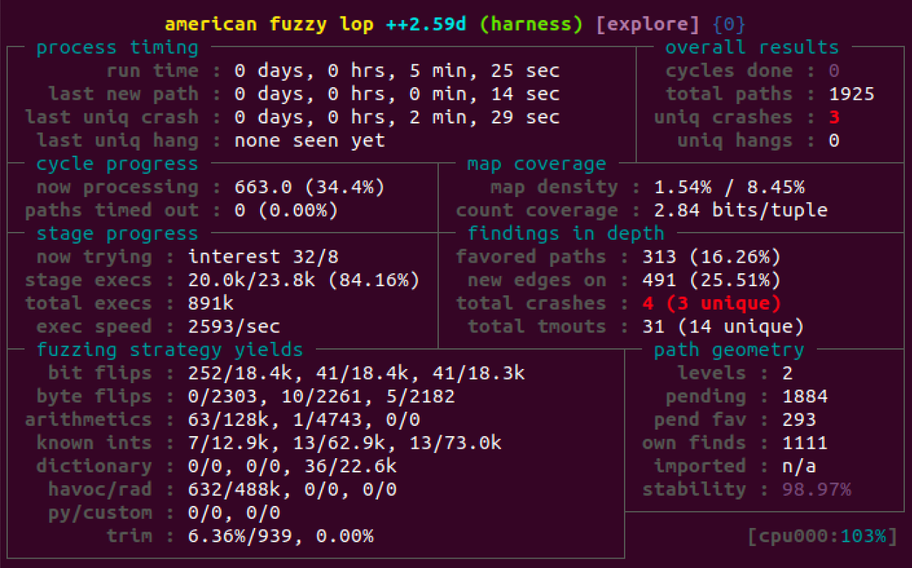

# Fuzzing

## Metasploit

In questo esempio, viene mostrato un esperimento di fuzzing su un semplice server FTP, tramite il tool Metasploit. Il codice del server FTP è disponibile nella macchina virtuale nella cartella `swsec-labs/fuzzing/ftp`, e nel repository online su <https://github.com/swsec-book/swsec-labs/>.

Nella sotto-cartella `ftp-server`, eseguite i seguenti comandi per scomprimere il codice sorgente dello FTP ed effettuarne il build del codice.

```
$ cd ftp-server

$ tar zxf hpaftpd.tgz

$ patch -p1 -d hpaftpd-1.05/ < hpaftpd-debug.patch

$ cd hpaftpd-1.05

$ make CFLAGS="-g"
```

Per verificare il funzionamento del server FTP, avviarlo con i comandi:

```
$ cd hpaftpd-1.05

$ fakechroot fakeroot ./hpaftpd -l -p2121 -unobody -d../ftp-root/
```

In un altro terminale, provate a connettervi al server FTP, usando `anonymous`sia come username sia come password.

```
$ ftp localhost 2121
Connected to localhost.

220 HighPerfomanceAnonymousFTPServer
Name (localhost:unina): anonymous
331 Password required for anonymous
Password: 

230 User anonymous logged in
Remote system type is UNIX.
Using binary mode to transfer files.

ftp> ls
227 Entering Passive Mode (127,0,0,1,4,0).
150 Open data connection
drwxr-xr-x    2 root root      4096 Sep 19 17:54 .
drwxr-xr-x    2 root root      4096 Sep 19 17:54 ..
-rw-r--r--    1 root root         5 Sep 19 16:13 ciao.txt
226 Transfer complete

ftp> pwd
257 "/" is current work directory.

ftp> quit
221 Goodbye.
```

**Nota**: Il server FTP tenta di creare una *chroot jail* e fare *de-privileging*, per mitigare potenziali tentativi di exploitation. Tuttavia, queste funzionalità richiedono i privilegi di amministratore, ad esempio tramite il comando `sudo`, che ostacolano l'automazione del testing (ad esempio, la raccolta di *core dump*). Ai fini dell'esperimento, per evitare il ricorso ai privilegi di amministratore, si esegue il server FTP in un ambiente fittizio tramite i comandi `fakechroot` e `fakeroot`, per simulare i privilegi per chroot jail e de-privileging.  

Per effettuare il fuzzing, lasciare il server FTP in esecuzione e in attesa di connessioni.

Su un'altra finestra di terminale, avviare `msfconsole`. Per avviare il fuzzing, inserire i comandi come segue. `msf6 >` rappresenta il prompt dei comandi di Metasploit.

In questo esempio, Metasploit genera richieste FTP in vari punti del protocollo, inserendo delle stringhe cicliche molto lunghe al posto dei dati originali. Le stringhe cicliche hanno lunghezza da 1 a 1000 caratteri, con incrementi di 100 caratteri ad ogni tentativo.

```
$ ./msfconsole

msf6 > search fuzzers

search fuzzers

Matching Modules
================

   #   Name                                            Disclosure Date  Rank    Check  Description
   -   ----                                            ---------------  ----    -----  -----------
   ...
   18  auxiliary/fuzzers/ftp/ftp_pre_post                               normal  No     Simple FTP Fuzzer
   ...

msf6 > use auxiliary/fuzzers/ftp/ftp_pre_post

msf6 > info

       Name: Simple FTP Fuzzer
     Module: auxiliary/fuzzers/ftp/ftp_pre_post
     ...

msf6 auxiliary(fuzzers/ftp/ftp_pre_post) > set RHOSTS 127.0.0.1
msf6 auxiliary(fuzzers/ftp/ftp_pre_post) > set RPORT  2121
msf6 auxiliary(fuzzers/ftp/ftp_pre_post) > set STARTSIZE 1
msf6 auxiliary(fuzzers/ftp/ftp_pre_post) > set ENDSIZE 100
msf6 auxiliary(fuzzers/ftp/ftp_pre_post) > set STEPSIZE 1000

msf6 auxiliary(fuzzers/ftp/ftp_pre_post) > run
```

Ripetere l'esperimento precedente, inserendo una vulnerabilità nel server FTP (un buffer overflow). Per inserire la vulnerabilità, usare il seguente comando.

```
$ patch -p1 -d hpaftpd-1.05/ < hpaftpd-vulnerable.patch
```

Ricompilare e ri-lanciare il server FTP. Il server andrà in crash quando la stringa che indica il comando FTP eccede i 4 caratteri. È possibile rilevare la vulnerabilità ri-lanciando Metasploit come nel caso precedente.

Per rimuovere la vulnerabilità, è possibile rimuovere la modifica con questo comando.

```
$ patch -R -p1 -d hpaftpd-1.05/ < hpaftpd-vulnerable.patch
```

## Boofuzz

In questo esempio, viene mostrato il fuzzing dello stesso server FTP dell'esempio precedente, tramite il tool Boofuzz. Fare riferimento all'esempio precedente per compilare e avviare il server FTP, e per inserire una vulnerabilità di buffer overflow.

Posizionarsi nella cartella `boofuzz`, e clonare il submodule Git contenente il tool.

```
$ cd boofuzz

$ git submodule update --init --recursive
```

Applicare la patch fornita insieme all'esempio, e installare il tool, come segue.

```
$ patch -d boofuzz-fuzzer/ -p1 < boofuzz-isalive.patch

$ cd boofuzz-fuzzer
$ pip3 install .
$ cd ..
```

Prima di avviare il fuzzing, avviare una nuova finestra di terminale, in cui eseguire il programma *process monitor* fornito da Boofuzz. Questo programma rileva gli eventuali crash del server FTP, raccoglie i log dei test (ad esempio, il messaggio che è stato inviato al server FTP prima del crash), raccoglie l'immagine di memoria del processo del server FTP al momento del crash (*core dump*), e ri-avvia il server FTP per ripetere i test.

```
$ ulimit -c unlimited
$ sudo bash -c "echo $PWD/core > /proc/sys/kernel/core_pattern"
$ sudo bash -c 'echo 0 > /proc/sys/kernel/core_uses_pid'
$ sudo systemctl disable apport.service

$ python3 boofuzz-fuzzer/process_monitor_unix.py -d ./coredumps

[04:11.23] Process Monitor PED-RPC server initialized:
[04:11.23] 	 listening on:  0.0.0.0:26002
[04:11.23] 	 crash file:    ..../boofuzz/boofuzz-crash-bin
[04:11.23] 	 # records:     0
[04:11.23] 	 proc name:     None
[04:11.23] 	 log level:     1
[04:11.23] awaiting requests...
```

Su un'altra finestra di terminale, avviare il fuzzing con questo comando.

```
$ python3 ftp_hpa.py
```

È possibile osservare il progresso del fuzzing sia tramite shell, sia tramite browser al link <http://localhost:26000>.

## Mutiny

In questo esempio, viene mostrato il fuzzing dello stesso server FTP dell'esempio precedente, tramite il tool Mutiny. Fare riferimento all'esempio precedente per compilare e avviare il server FTP, e per inserire una vulnerabilità di buffer overflow.

Installare `scapy`.

```
$ pip3 install scapy
```

Posizionarsi nella cartella `mutiny`. Se non è stato già fatto nell'esempio precedente, effettuare il clone dei submodule nel repository.

```
$ cd mutiny

$ git submodule update --init --recursive
```

Mutiny utilizza internamente il tool `radamsa`, un fuzzer a linea di comando. Compilare `radamsa` come segue.

```
$ cd mutiny-fuzzer

$ tar zxf radamsa-v0.6.tar.gz
$ cd radamsa-v0.6/
$ make
$ cd ..
```

Prima di applicare Munity, è necessario disporre di una traccia di traffico di rete FTP, in formato PCAP. Nella cartella con l'esempio, viene fornito il file PCAP `ftp.pcap`.

Per stampare il contenuto del file PCAP:

```
$ tshark -r  ftp.pcap -V
```

Il primo passo per utilizzare Mutiny è di configurare il fuzzer usando il file PCAP, tramite lo script `mutiny_prep.py`. Quando chiede di *combine payloads into single messages*, è possibile rispondere "no". Selezionare la risposta di default per le altre domande. Lo script creerà il file `ftp-0.fuzzer`.

```
$ cd mutiny-fuzzer

$ python3 mutiny_prep.py -a ../ftp.pcap
```

Avviare il server FTP in una finestra di terminale separata.

Infine, avviare il fuzzer.

```
$ python3 mutiny.py ftp-0.fuzzer 127.0.0.1
```

## AFL

In questo esempio, viene mostrato il fuzzing della libreria open-source `libxml2`, tramite il tool AFL, per riprodurre la vulnerabilità `CVE-2015-8317` (heap buffer overflow). Il codice è disponibile nella macchina virtuale nella cartella `examples/fuzzing-examples`, e nel repository online su <https://github.com/swsec-book/fuzzing-examples/>.

Per effettuare il fuzzing della libreria, è necessario creare un programma (*test harness*) che incorpori la libreria e ne chiami le funzioni. In questo esempio, viene usato un programma che legge un file XML e ne faccia la stampa (*dump*) tramite la libreria. Nel caso in cui il file in ingresso non sia in formato XML corretto, la libreria produce un messaggio di errore.

```
$ ./harness regressions.xml
<?xml version="1.0"?>
<RegressionTests>
<!--
  Within the following test descriptions the possible elements are:
  ...
</RegressionTests>

$ ./harness ciao.txt
ciao.txt:1: parser error : Start tag expected, '<' not found
ciao mondo
^
```


Scomprimere l'archivio `libxml2-2.9.2.tar.gz`. All'interno della cartella della libreria, creare il file `harness.c` con il seguente codice.

```
#include "libxml/parser.h"
#include "libxml/tree.h"

int main(int argc, char **argv) {

    xmlInitParser();

    xmlDocPtr doc = xmlReadFile(argv[1], NULL, 0);

    xmlDocDump(stdout, doc);

    if (doc != NULL)
        xmlFreeDoc(doc);

    xmlCleanupParser();

    return(0);
}
```

Compilare la libreria e il programma harness con i seguenti comandi.

```
$ cd libxml2-2.9.2

$ CC=afl-clang-fast  ./autogen.sh

$ CC=afl-clang-fast  ./configure  --with-python=no --disable-shared

$ AFL_USE_ASAN=1 make -j 4 libxml2.la

$ AFL_USE_ASAN=1 afl-clang-fast  ./harness.c .libs/libxml2.a 
                      -Iinclude  -lz  -o harness
```

Avviare AFL con il seguente comando. Il comando indica al fuzzer di usare come *seed* i file nella cartella `go-fuzz-corpus/xml/corpus/`.

```
$ afl-fuzz  -i <PATH>/go-fuzz-corpus/xml/corpus/ 
            -o afl_libxml2 
            -m none
            -- ./harness @@
```

Il fuzzer rileva la vulnerabilità dopo pochi minuti.


