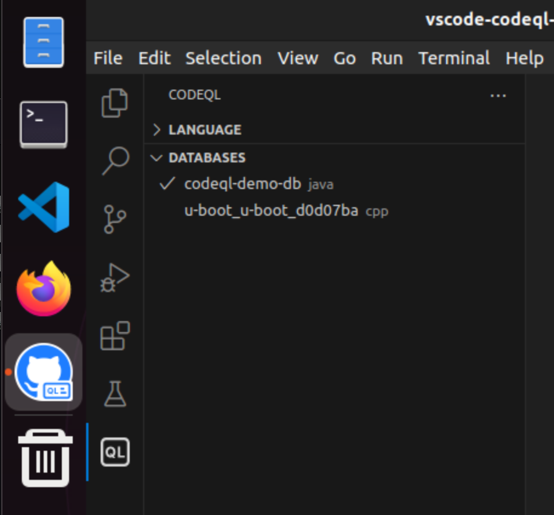
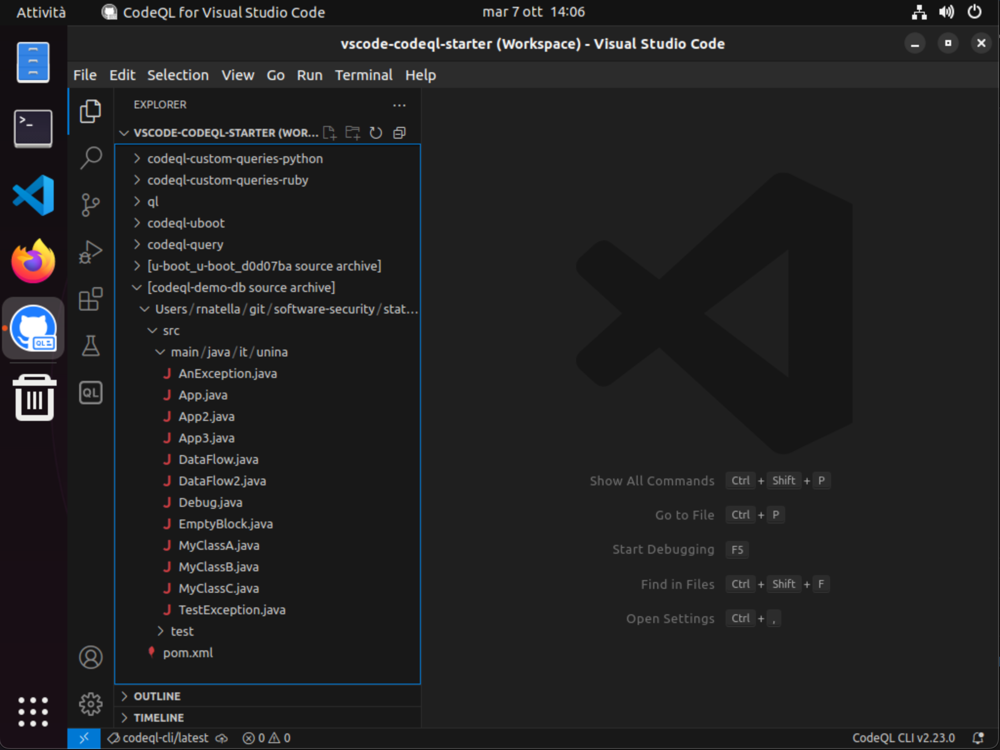
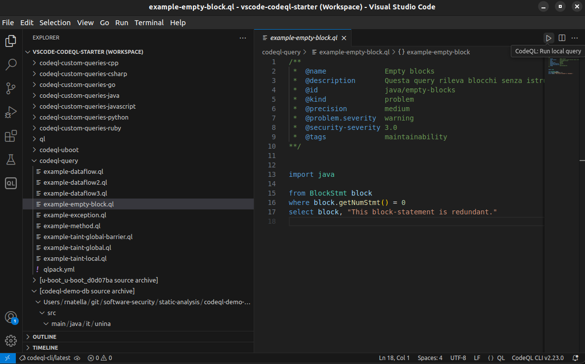
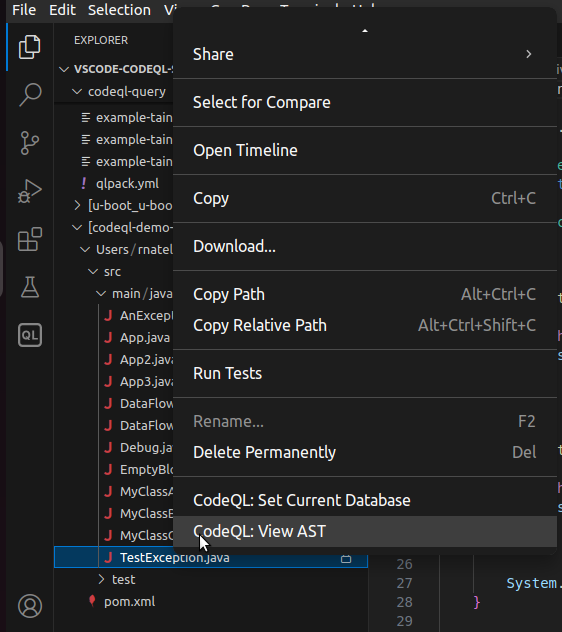
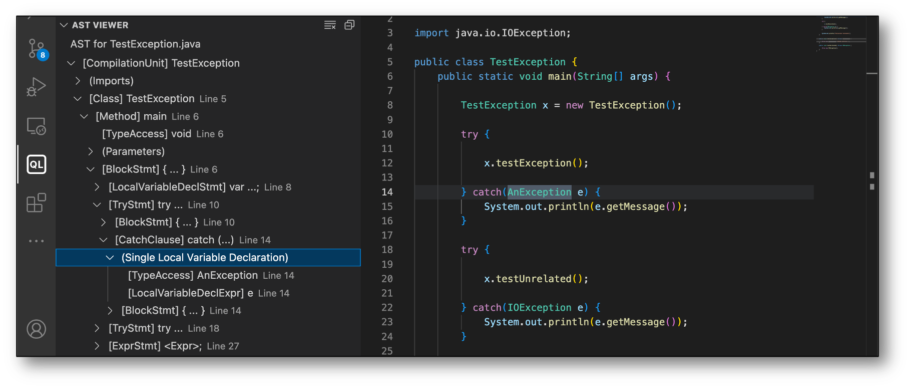
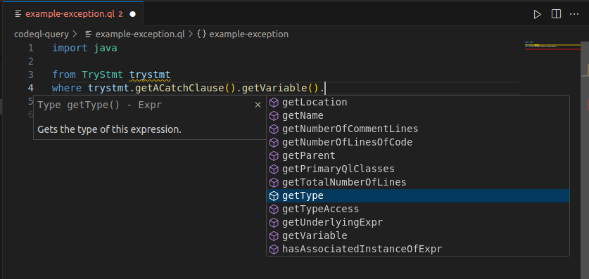
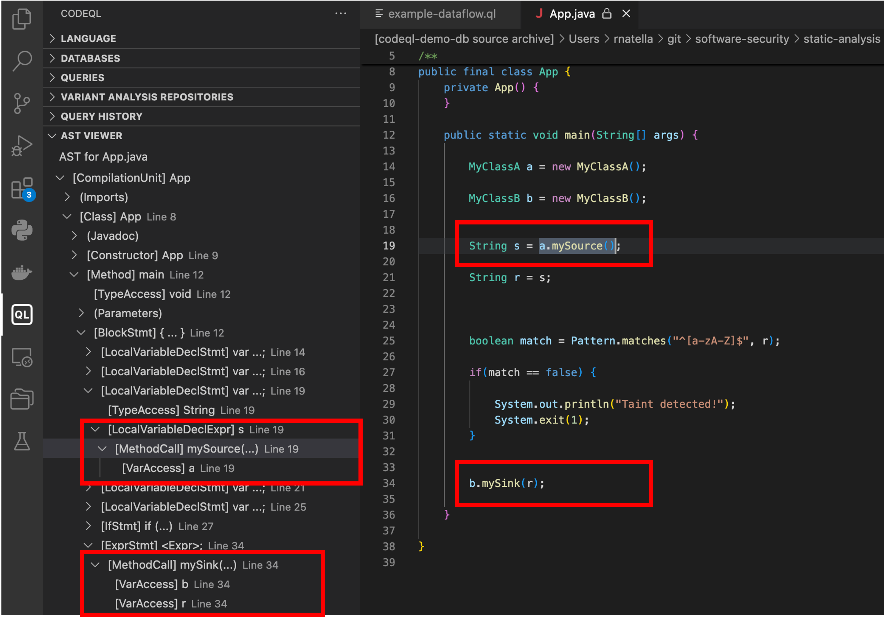
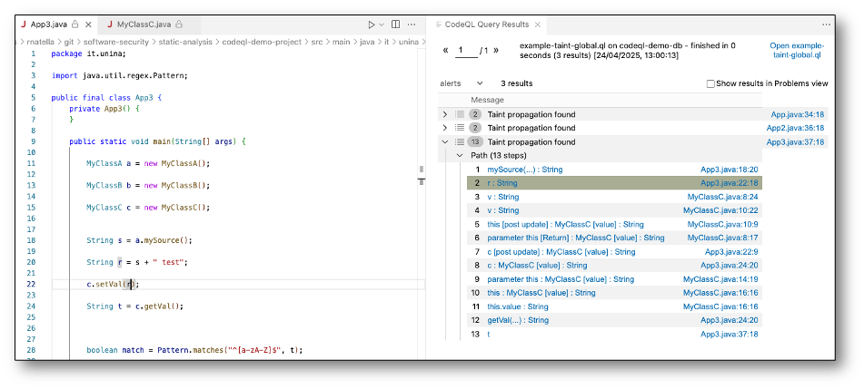

# Static analysis

## CodeQL - query puntuali

Sono qui mostrati alcuni esempi di analisi statica su piccoli programmi, tramite il framework **CodeQL**. Sia il codice dei programmi da analizzare, sia il codice delle query, sono disponibili nella macchina virtuale nella cartella `swsec-labs/static-analysis/`, e nel repository online su <https://github.com/swsec-book/swsec-labs>.

Posizionatevi nella cartella `codeql-demo-project`, ed effettuate il build del progetto per verificarne il corretto funzionamento.

```
$ cd codeql-demo-project

$ mvn clean install
```

Per creare un database CodeQL del progetto, ripetere il build del progetto tramite il comando `codeql` come segue.

```
$ codeql database create "codeql-demo-db" --language=java
```

Il database è già disponibile nel file `codeql-demo-db.zip` cartella.

Avviare VSCode con il workspace fornito con CodeQL, tramite la scorciatoia fornita sul desktop della macchina virtuale, oppure tramite il seguente comando.

```
code ~/vscode-codeql-starter/vscode-codeql-starter.code-workspace
```

Nella barra laterale di VSCode, clickate sulla icona della estensione CodeQL (simbolo "QL"). Nella sezione *database* utilizzare la funzione di import del database, selezionando il file zip del database del progetto di esempio. 



Nella barra laterale di VSCode, clickate sulla icona della sezione *Explorer* (prima icona). Da lì è possibile visualizzare il codice sorgente della applicazione, che è stato incluso nel database appena importato.



Sempre nella sezione *Explorer*, nella sotto-cartella `codeql-query`, sono presenti vari file con estensione `.ql` contenenti le query di questo esempio.

La query di esempio in `example-empty-block.ql` cerca blocchi IF in programmi Java che non hanno alcuna istruzione al loro interno. È possibile lanciare la query clickando sulla icona di esecuzione in alto a destra (*CodeQL: Run local query*), oppure cliccando sul nome del file `.ql` e selezionando *CodeQL: Run Queries in Selected Files*.

```
import java

from BlockStmt block
where block.getNumStmt() = 0
select block, "This block-statement is redundant."
```



La query rileva il seguente codice (`EmptyBlock.java`).

```
package it.unina;

public class EmptyBlock {

    int write(int[] buf, int size, int loc, int val) {

        if (loc >= size) {
           // return -1;
        }
    
        buf[loc] = val;
    
        return 0;
    }
    
}
```


La seguente query (`example-exception.ql`) cerca tutte le occorrenze di blocchi CATCH in cui l'eccezione gestita sia di tipo `AnException`.

```
import java

from TryStmt trystmt
where trystmt.getACatchClause()
             .getVariable()
             .getType()
             .getName() = "AnException"
select trystmt,"Try-catch block found!"
```

CodeQL rileva una occorrenza del pattern nel file `TestException.java`.

Ai fini di scrivere query CodeQL, è utile ispezionare lo Abstract Syntax Tree (AST) di un programma contenente il pattern di interesse. In questo caso, è possibile utilizzare la funzione *CodeQL: View AST*, cliccando con il tasto destro sul nome del file `TestException.java`.





Lo AST mostra che:

- Il blocco TRY è rappresentato dalla classe `TryStmt`
- La classe `TryStmt` contiene un riferimento a un `BlockStmt`, e un riferimento a `CatchClause`
- La classe `CatchClause` contiene una dichiarazione di variabile, il cui tipo rappresenta la eccezione gestita.

Nello sviluppo delle query, è possibile partire dai nomi delle classi nello AST, e consultare i metodi forniti da ogni classe usando l'ambiente di sviluppo. L'elenco dei metodi è consultabile tramite i tasti CONTROL + SPAZIO.




## CodeQL - query di data flow

CodeQL permette di cercare flussi di dati all'interno di un programma, ad esempio per rilevare vulnerabilità di tipo *injection*. Nella query CodeQL, è possibile definire i punti del programma che rappresentano fonti di dati (*source*) e i punti del programma che rappresentano destinazioni "pericolose" (*sink*), come ad esempio le funzioni che accedono ad un database nel caso di SQL injection. CodeQL verificherà la presenza di flussi tra tutti i source e tutti i sink identificati dalla query.

CodeQL permette due tipi di query di analisi data flow.

- Analisi *intra-procedurale* (local):
    - Analizza i flussi all'interno di una singola funzione
    - Peso computazionale leggero
    - Utilizza i predicati *localFlow()* e *localTaint()*


- Analisi *inter-procedurale* (global):
    - Analizza i flussi che attraversano più funzioni
    - Peso computazionale elevato
    - Utilizza i predicati *isSource()* e *isSink()*

Inoltre, CodeQL distingue tra "*Dataflow analysis*" e "*Taint analysis*". In entrambi i casi, analizza i flussi di dati nel programma. Nel caso di *Dataflow analysis*, CodeQL è più conservativo nella ricerca dei flussi, focalizzandosi solo su quelli che sia sicuro siano percorribili, per evitare i falsi allarmi; invece, nel caso di *Taint analysis*, CodeQL include anche flussi che sono potenzialmente non percorribili, aumentando la possibilità di falsi allarmi.

Ad esempio, nel seguente codice, è presente un flusso tra il valore di ritorno della funzione `mySource()`, e il valore di ingresso della funzione `mySink()`. 
Il flusso include una operazione "non-value-preserving", in cui la variabile `s` è combinata con una stringa nel corso del flusso. Questa modifica potrebbe vanificare un eventuale attacco. Nel caso di *Dataflow analysis*, i flussi con operazioni "non-value-preserving" sono ignorati, per evitare falsi allarmi. Nel caso di *Taint analysis*, questi flussi sono tenuti in considerazione.

```
  String s = a.mySource();
  String r = s + " test";   // operazione "non-value-preserving"

  ...

  b.mySink(r);
```

Il seguente esempio mostra una query di *taint analysis* di tipo *intra-procedurale*, ricercando i flussi tra le funzioni `mySource()` e `mySink()`. La query è nel file `example-taint-local.ql`.

```
import java
import semmle.code.java.dataflow.DataFlow::DataFlow
import semmle.code.java.dataflow.TaintTracking

from MethodCall a, MethodCall b, VarAccess arg
where a.getCallee().getName() = "mySource" and
      b.getCallee().getName() = "mySink" and
      arg = b.getAnArgument() and
      TaintTracking::localTaint(exprNode(a), exprNode(arg))
select arg, "data flow found"
```

La query rileva due risultati, nei file `App.java` (ha un flusso con solo operazioni value-preserving) e `App2.java` (include una operazione non-value-preserving, come nell'esempio precedente).



Se si modifica la query precedente, usando il predicato `localFlow()` al posto di `localTaint()`, viene rilevato solo il flusso in `App.java`, ma non in `App2.java`.

Il seguente esempio mostra una query di *taint analysis* di tipo *inter-procedurale*. Anche in questo caso, si cercano flussi tra le funzioni `mySource()` e `mySink()`. Le query inter-procedurali richiedono di usare il costrutto `module` del linguaggio CodeQL, in cui definire i due predicati che identificano i source e i sink della analisi. In questo caso, si ricercano i source appartenenti alla classe `MyClassA`, e i sink appartenenti alla classe `MyClassB`. La query è nel file `example-taint-global.ql`.

```
/** 
 * @kind path-problem
 * @id java/my-taint-propagation
 * @precision high
 * @security-severity 9.9
 * @problem.severity error
**/

import java
import semmle.code.java.dataflow.TaintTracking

module MyTaintConfig implements DataFlow::ConfigSig {

	predicate isSource(DataFlow::Node source) {
		exists(MethodCall ma | 
			source.asExpr() = ma and
			ma.getCallee().getName() = "mySource" and
			ma.getCallee().getDeclaringType().getName() = "MyClassA"
		)
	}

	predicate isSink(DataFlow::Node sink) {
		exists(VarAccess arg, MethodCall mb |
			sink.asExpr() = arg and
			arg = mb.getAnArgument() and
			mb.getCallee().getName() = "mySink" and
			mb.getCallee().getDeclaringType().getName() = "MyClassB"
		)
	}
  
}

module MyTaint = TaintTracking::Global<MyTaintConfig>;

import MyTaint::PathGraph

from MyTaint::PathNode source, MyTaint::PathNode sink
where MyTaint::flowPath(source, sink) 
select sink.getNode(), source, sink, "Taint propagation found"
```

La query riporta tre risultati. Oltre ai flussi nei file `App.java` e `App2.java` dell'esempio precedente, la query rileva un flusso inter-procedurale nel file `App3.java`.




