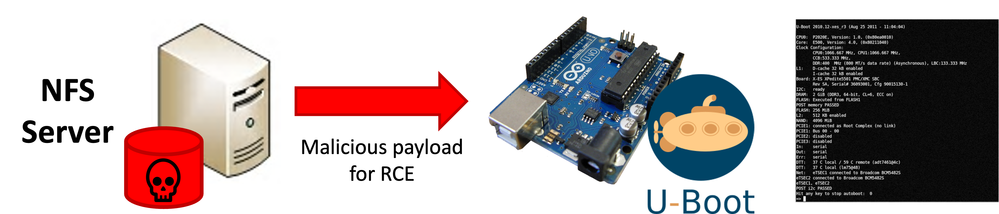
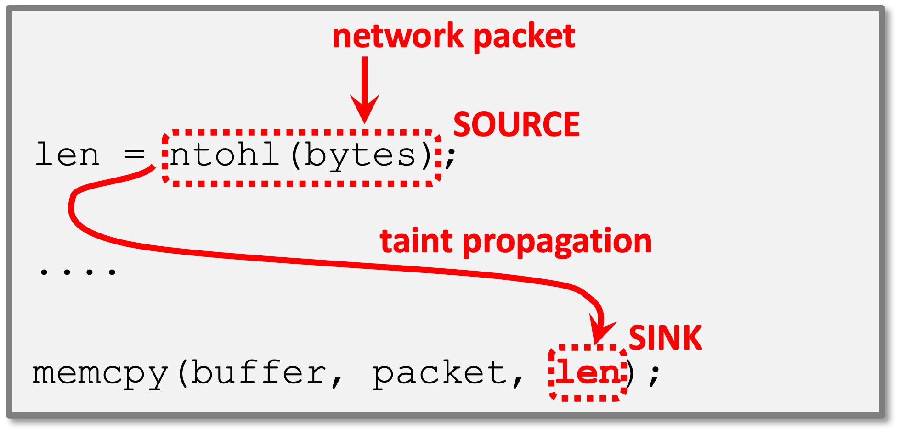
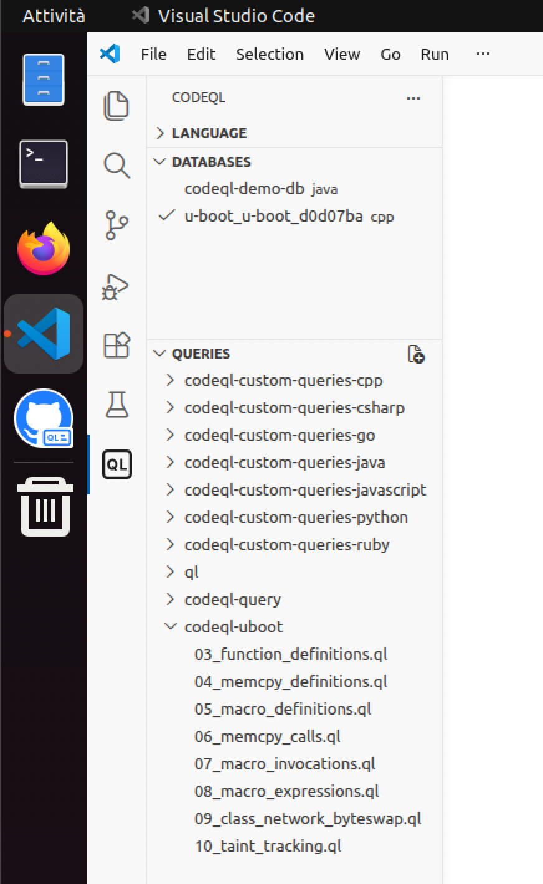

# Esercizi su analisi statica {#static-analysis-exercises}

Il seguente esercizio chiede di identificare delle vere vulnerabilità di *buffer-overflow* nel progetto open-source U-Boot tramite analisi statica con CodeQL.

U-Boot è un *boot-loader* utilizzato per l'avviamento del sistema operativo in sistemi embeddedd. Le vulnerabilità possono essere attaccate quando U-Boot è configurato per caricare i file di avviamento dalla rete. L'attaccante è in grado di aggirare i controlli sulla validità dei file basati su firma digitale.



Il codice dell'esercizio è disponibile nella macchina virtuale nella cartella `swsec-labs/static-analysis/`, e nel repository online su <https://github.com/swsec-book/swsec-labs>. L'esercizio è tratto da una competizione online *capture-the-flag* organizzata dal GitHub Security Lab (<https://securitylab.github.com/ctf/uboot/>).

Il codice del progetto U-Boot contiene numerosi punti che:

- leggono dati dalla rete (*source* della taint propagation);
- passano i dati alla funzione `memcpy()` nel parametro `size` (*sink* della taint propagation);
- non effettuano alcuna input validation.



L'esercizio richiede di scrivere una query CodeQL per identificare le chiamate non sicure di questo tipo alla funzione `memcpy()`.

## Query di esempio

Nella macchina virtuale, avviare Visual Studio Code con l'estensione per CodeQL, utilizzando l'icona nella barra a sinistra di Ubuntu.
Poi, posizionarsi nella sezione di Visual Studio Code dedicata a CodeQL, cliccando sul simbolo "QL" in basso nella barra  a sinistra di Visual Studio Code.



Per svolgere il primo esercizio, selezionare il database "u-boot" nel menu in alto a sinistra. Poi, aprire il file `03_function_definitions.ql` nella sezione "queries" a sinistra.

Inserire nel file il seguente codice. Si raccomanda di *non fare copia-incolla*, ma di digitarlo manualmente, per familiarizzare con la sintassi e con l'editor.

```ql
import cpp

from Function f
where f.getName() = "strlen"
select f, "a function named strlen"
```

CodeQL fornirà dei suggerimenti tramite auto-completamento:

- Dopo aver digitato `from` e le prime lettere di `Function`, l'ambiente proporrà una lista di *classi* dalla libreria di CodeQL. Questo meccanismo permette di scoprire quali classi sono disponibili per rappresentare il codice sorgente.
- Dopo aver digitato `where f.`, l'ambiente proporrà una lista di *predicati* che possono essere chiamati sulla variabile `f`.
- Digita le prime lettere di `getName()` per restringere la lista.
- Muovi il cursore sul nome di un predicato per consultarne la documentazione. Questo meccanismo permette di scoprire quali predicati sono disponibili e cosa fanno.

Eseguire la query, cliccando sul nome del file con il tasto destro, e selezionando **CodeQL: Run Query**.

Analizza i risultati che appaiono nel pannello dei risultati. Clicca sugli hyperlink dei risultati per navigare nel codice sorgente di U-Boot in cui sono stati trovati i risultati. Cosa fa questa query?

## Definizione di `memcpy()`

In questo esercizio, scrivi una nuova query nel file `04_memcpy_definitions.ql`. 

Copia la query dell'esercizio precedente in questo file, e modifica la clausola `where` in modo da trovare le definizioni delle funzioni di nome `memcpy`.

Esegui la query sul progetto U-Boot per verificare i risultati.

## Definizione delle macro

In questo esercizio, scrivi una nuova query nel file `05_macro_definitions.ql`. 

Scrivi una query che trovi le definizioni delle macro di nome `ntohs`, `ntohl`, o `ntohll`. Usa l'auto-completamento come guida.

- Attendi brevemente dopo aver scritto `from` per ottenere la lista delle classi disponibili per programmi C/C++. Quale classe nella lista rappresenta le macro? Crea una variabile nella query, usando questa classe come tipo.

- Nella sezione `where`, scrivi il nome della variabile che hai creato seguita da un punto `.`, e attendi brevemente che l'ambiente mostri una lista di predicati disponibili per quel tipo di variabile. Consulta la documentazione di questi predicati. Quale predicato fornisce il nome di una macro?

- Usa la keyword `or` per combinare più condizioni nella query. In questo caso, vogliamo trovare le definizioni che appartengano ad almeno uno di tre possibili nomi.

Dopo aver completato la query, prova a scrivere una versione più compatta che eviti l'uso di `or`. Puoi utilizzare una espressione regolare, tramite il predicato `string::regexpMatch` (disponibile tra i [predicati built-in per le stringhe](https://codeql.github.com/docs/ql-language-reference/ql-language-specification/#built-ins-for-string)). CodeQL usa le convenzioni di Java per le espressioni regolari.

Inoltre, prova ad utilizzare la sintassi dei *set* di CodeQL per confrontare il nome della macro con un insieme di possibili valori (ad esempio `["bar", "baz", "quux"]`).


## Chiamate alla funzione `memcpy()`

In questo esercizio, scrivi una nuova query nel file `06_memcpy_calls.ql`. 

Questo esercizio richiede di cercare con CodeQL tutti i punti del programma che **chiamano** la funzione `memcpy`, a differenza del caso precedente che ha cercato i punti di **definizione** delle funzioni.

Procedere nel seguente modo:

- Nella clausola `FROM`, dichiarare due variabili: (1) una variabile per le *dichiarazioni di funzioni* (come per gli esercizi precedenti); (2) una per le *chiamate a funzione*. Si utilizzi l'auto-completamento per trovare la classe che rappresenta le chiamate a funzione.
- Nella clausola `WHERE`, si utilizzi un predicato della prima variabile (dichiarazione di funzione) per indicare che il nome della funzione dichiarata sia `memcpy`, in modo analogo agli esercizi precedenti.
- Inoltre, nella clausola `WHERE`, si utilizzi un predicato della seconda variabile (chiamata a funzione) per indicare che la funzione chiamata sia uguale alla prima variabile (la dichiarazione della funzione `memcpy`). Usare l'auto-completamento per trovare il predicato che rappresenta la funzione che viene chiamata ("target").

Esempio di ricerca di tutte le chiamata alla funzione `std::map<...>::find()` (nota: in questo esercizio non è necessario usare il predicato `getDeclaringType`).

```ql
import cpp

from FunctionCall call, Function fcn
where
  call.getTarget() = fcn and
  fcn.getDeclaringType().getSimpleName() = "map" and
  fcn.getDeclaringType().getNamespace().getName() = "std" and
  fcn.hasName("find")
select call
```

Dopo aver completato la query, prova a modificarla per renderla più semplice, evitando di usare la variabile `Function`. Le 2 seguenti query sono equivalenti:


```ql
from Class1 c1, Class2 c2
where
  c1.getClass2() = c2 and
  c2.getProp() = "something"
select c1
```

```ql
from Class1 c1
where c1.getClass2().getProp() = "something"
select c1
```


## Invocazioni delle macro

In questo esercizio, scrivi una nuova query nel file `07_macro_invocations.ql`. 

Questo esercizio richiede di trovare tutte le *invocazioni* delle macro `ntohs`, `ntohl` e `ntohll`. La query è simile all'esercizio precedente. Le *invocazioni di macro* sono analoghe alle *chiamate a funzione*. Tuttavia, è necessario usare una classe CodeQL differente.

- Usare l'auto-completamento per trovare la classe CodeQL che rappresenta le invocazioni di macro, e dichiarare una variabile che appartiene a questa classe.
- Usare l'auto-completamento sulla variabile della invocazione della macro, per trovare il predicato che indica la macro che viene invocata ("target").
- Combinare questi elementi con la logica degli esercizi precedenti per fare in modo che il target sia una della macro `ntoh*`.
- Come prima, è possibile semplificare la query omettendo la variabile superflua.

## Espressioni

In questo esercizio, scrivi una nuova query nel file `08_macro_expressions.ql`. 

A partire dalle invocazioni di macro trovate dall'esercizio precedente, si vuole ora trovare le *espressioni* del programma che contengono le invocazioni della macro `ntohs`, `ntohl` e `ntohll`. Nei linguaggi di programmazione, una espressione è una porzione del programma che contiene delle operazioni, in questo caso una invocazione di macro.

Nella clausola `SELECT`, si utilizzi il [predicato `getExpr()`](https://codeql.github.com/codeql-standard-libraries/cpp/semmle/code/cpp/Macro.qll/predicate.Macro$MacroInvocation$getExpr.0.html) sulla variabile che rappresenta la invocazione, per ottenere l'espressione che la contiene.

L'espressione così trovata rappresenterà il *source* della taint propagation analysis.

## Creare una nuova classe

In questo esercizio, scrivi una nuova query nel file `09_class_network_byteswap.ql`. 

Questo esercizio prevede di scrivere una [nuova classe CodeQL](https://codeql.github.com/docs/ql-language-reference/types/#classes). La classe permette di scrivere query più facili da leggere e da riutilizzare.

Si definisca una classe per rappresentare il sotto-insieme di invocazioni verso le sole macro `ntohl`, `ntohs` e `ntohll`. Sarà possibile usare la classe in modo analogo alla classe `MacroInvocation`, ma per indicare solo un sotto-insieme delle invocazioni di macro.

In particolare, la nuova classe deve essere una sotto-classe di `Expr`. Come nell'esercizio precedente, useremo un predicato per ottenere le *espressioni* che contengono le invocazioni alle macro `ntohl`, `ntohs` e `ntohll`.

In questa query, utilizzeremo la [sintassi *exists*](https://codeql.github.com/docs/ql-language-reference/formulas/#explicit-quantifiers). Questa sintassi è utile per definire dei nuovi predicati e classi: essa introduce una variabile temporanea, e determina i valori che soddisfano una certa condizione (**quantifier**).

Altri esempi sono disponibili nel tutorial CodeQL ["Find the thief"](https://codeql.github.com/docs/writing-codeql-queries/find-the-thief/).

Per risolvere l'esercizio, si completi il seguente codice:

```ql
import cpp

class NetworkByteSwap extends Expr {
  NetworkByteSwap () {
    // TODO: replace <class> and <var>
    exists(<class> <var> |
      // TODO: <condition>
    )
  }
}

from NetworkByteSwap n
select n, "Network byte swap"
```


- La notazione `extends Expr` indica che la classe è una sotto-classe di `Expr`. La query inizierà selezionando tutti i valori di tipo `Expr`, che saranno poi ulteriormente selezionati per ottenere le sole espressioni verso le tre macro come nell'esercizio precedente.
- La sintassi `NetworkByteSwap() { ... }` rappresenta il [predicato caratterizzante della classe](https://codeql.github.com/docs/ql-language-reference/types/#characteristic-predicates). Il predicato seleziona il sotto-insieme di elementi della classe `Expr` che appartengono alla sotto-classe `NetworkByteSwap`.
- Nella prima parte della sintassi di `exists` (prima del carattere `|`), occorre dichiarare una variabile temporanea `my_invocation`che rappresenti le invocazioni di macro. La sintassi è simile a quella della clausola `FROM`, senza questa parola chiave, ma solo con il nome della classe e il nome della variabile.
- Nella seconda parte della sintassi di `exists` (dopo il carattere `|`), occorre inserire una condizione per indicare che la invocazione `my_invocation` abbia come target le tre macro `ntohl`, `ntohs` e `ntohll`. La sintassi è simile a quella della clausola `WHERE`, senza questa parola chiave.
- Nella seconda parte della sintassi di `exists`, occorre anche inserire una ulteriore condizione in `AND` con il punto precedente. Occorre indicare che le espressioni da assegnare alla sotto-classe (rappresentati dalla parola chiave `this`) siano uguali alla espressione che contiene l'invocazione `my_invocation`.


## Analisi di taint tracking

In questo esercizio, scrivi una nuova query nel file `10_taint_tracking.ql`. 

Si vuole combinare le query degli esercizi precedenti, per trovare tutti i flussi nel programma che collegano i *source* (le invocazioni delle macro) con i *sink* (il terzo parametro delle chiamate a *memcpy*). Di tutte le centinaia di chiamate a `memcpy` e invocazioni delle macro, saranno identificati solo i casi vulnerabili.

Per la query, utilizzare la libreria [taint tracking](https://codeql.github.com/docs/codeql-language-guides/analyzing-data-flow-in-cpp/) di CodeQL. La libreria fornisce il predicato `flowPath()` per determinare quali source sono collegate a dei sink.

Per risolvere l'esercizio, si completi il seguente codice:

```ql
/**
 * @kind path-problem
 */

import cpp
import semmle.code.cpp.dataflow.TaintTracking

class NetworkByteSwap extends Expr {
  // TODO: copy from previous step
}

module MyConfig implements DataFlow::ConfigSig {

  predicate isSource(DataFlow::Node source) {
    // TODO
  }
  predicate isSink(DataFlow::Node sink) {
    // TODO
  }
}

module MyTaint = TaintTracking::Global<MyConfig>;
import MyTaint::PathGraph

from MyTaint::PathNode source, MyTaint::PathNode sink
where MyTaint::flowPath(source, sink) 
select sink, source, sink, "Network byte swap flows to memcpy"
```

- Ri-utilizzare il codice della classe `NetworkByteSwap` dell'esercizio precedente
- Completare il predicato `isSource()`, in modo che esso ritorni `true` per i nodi del grafo data flow che rappresentano le invocazioni delle macro `ntohl`, `ntohs`, e `ntohll`.
    - Occorre verificare che la variabile `source` appartenga alla classe `NetworkByteSwap`. È possibile usare la sintassi `<value> instanceof <myclass>`.
    - Nota che la variabile `source` è di tipo `DataFlow::Node` (grafo data flow), mentre la classe `NetworkByteSwap` è una sotto-classe di `Expr` (grafo AST). Per cui, non è sufficiente scrivere `source instanceof NetworkByteSwap` (il compilatore segnalerà un errore). Usare l'auto-completamento sulla variabile `source` per trovare il predicato che permette di convertire la variabile in `Expr`.
- Completare il predicato `isSink()`, in modo che esso ritorno `true` per i nodi del grafo data flow che rappresentano il terzo parametro di una chiamata alla funzione `memcpy`.
    - Usare l'auto-completamento per trovare *il predicato che restituisce lo n-esimo parametro* di una chiamata a funzione.
    - Usare il predicato trovato nel punto precedente per convertire la variabile `sink` (grafo data flow) in `Expr` (grafo AST).


**Nota:** [Questo articolo](https://securitylab.github.com/research/cve-2018-4259-macos-nfs-vulnerability) riporta un esempio completo.

**Nota:** È necessario includere la annotazione iniziale *path-problem* e la sintassi di `SELECT` come indicato nel codice di partenza. Esse configurano l'ambiente per visualizzare i risultati della query come percorsi di taint propagation, invece che come singole linee di codice.


## Input validation

È possibile estendere la query di taint tracking in modo da escludere i casi non-vulnerabili. In alcuni casi, il percorso di taint propagation contiene una istruzione di input validation, che previene il buffer overflow.

Per escludere i casi con input validation, si estenda la precedente classe `MyConfig` aggiungendo il predicato `isBarrier()`. Si lascia come esercizio aperto lo stabilire in che modo rilevare la presenza di input validation.

