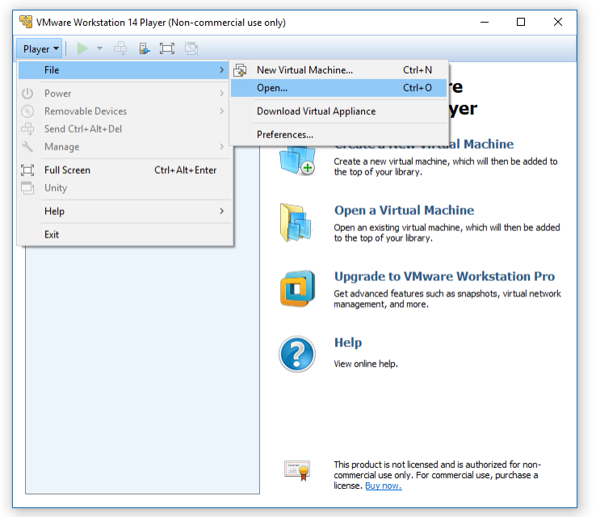
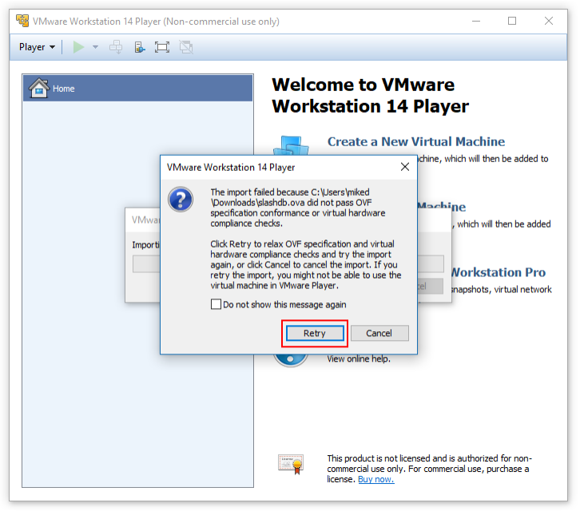
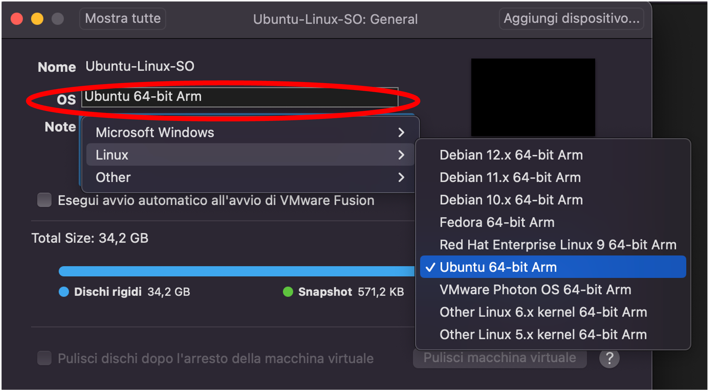

# Setup

Per riprodurre gli esempi riportati in questo sito, e per svolgere gli esercizi, è possibile utilizzare la macchina virtuale Linux (virtual machine, VM) fornita in questo sito web. La VM è predisposta con gli strumenti e le applicazioni utilizzati negli esempi e negli esercizi.

## Sistemi Windows

Si consiglia di eseguire la macchina virtuale usando il software **VMware Workstation** sui sistemi Windows. Il software è utilizzabile gratuitamente, ed è disponibile sul sito <https://www.vmware.com/products/desktop-hypervisor/workstation-and-fusion>.

Successivamente, scaricare sul proprio computer il file della macchina virtuale. Il file è in formato OVF (*Open Virtualization Format*), ed ha estensione **.OVA** (*Open Virtual Appliance*). È possibile utilizzare uno qualunque dei seguenti link:

- [Google Drive](https://drive.google.com/file/d/1DsOl31weWqIctVCCZaLRwJePRvYCjJ5Z/view?usp=sharing)
- ...
- ...

Informazioni sul file:

- **Nome del file**:        Software-Security-Linux-x86-2026.OVA
- **Dimensione**:           11.37 GB
- **Ultimo aggiornamento**: 21/03/2026
- **Hash SHA1**:            081eeaec6f28662e18c02675a49a4db49251309a
- **Hash MD5**:             6efc90d88709ae7a03c89ad0f2071d29


È possibile verificare l'integrità del file scaricato, confrontando i valori di hash nella tabella con quelli del file scaricato. Per ottenere i valori di hash, aprire la console dei comandi **PowerShell**, e digitate i seguenti comandi testuali.

```
cd Downloads
Get-FileHash -Algorithm SHA1 -Path "Software-Security-Linux-x86.OVA"
Get-FileHash -Algorithm MD5 -Path "Software-Security-Linux-x86.OVA"
```

Importate il file .OVA in VMware Workstation, utilizzando il menù **File > Open**, e selezionando il file .OVA. Inserite il nome desiderato per la macchina virtuale, e selezionate la cartella in cui salvare i file della macchina virtuale. Infine, clickate sul tasto **Importa**. Il processo può impiegare alcuni minuti.



È possibile che VMware mostri un messaggio di errore relativo alle verifiche di conformità OVF. È possibile ignorare l'errore, clickando sul tasto **Retry**.



Al termine, la macchina virtuale è disponibile nella lista di VMware Workstation. È possibile modificare le risorse hardware della macchina virtuale (in particolare, il numero di CPU e la quantità di RAM) nelle impostazioni della macchina virtuale.

Avviate la macchina virtuale per verificare il corretto funzionamento. All'avvio, il login è automatico. È possibile usare le seguenti credenziali nel caso sia richiesto:

- **Username**: swsec
- **Password**: swsec

Verificare l'accesso ad internet dalla macchina virtuale, utilizzando ad esempio il browser Firefox per visitare un sito web. Nel caso che non sia possibile accedere ad internet, verificare nelle impostazioni della macchina virtuale che la scheda di rete virtuale sia impostata in modalità NAT.


## Sistemi Mac

Si consiglia di eseguire la macchina virtuale usando il software **VMware Fusion** sui sistemi Mac. Il software è utilizzabile gratuitamente, ed è disponibile sul sito <https://www.vmware.com/products/desktop-hypervisor/workstation-and-fusion>.

Successivamente, scaricare sul proprio computer il file della macchina virtuale. Il file è in formato OVF (*Open Virtualization Format*), ed ha estensione **.OVA** (*Open Virtual Appliance*). È possibile utilizzare i seguenti link:

- [Google Drive](https://drive.google.com/file/d/1hiXtFeFKwparJMHjMMvMGUbygOzCOfTJ/view?usp=sharing)
- ...
- ...

Informazioni sul file:

- **Nome del file**:        Software-Security-Linux-ARM-2026.OVA
- **Dimensione**:           11.75 GB
- **Ultimo aggiornamento**: 21/03/2026
- **Hash SHA1**:            43d458aecc041feda3ec2c33179ef270f9627104
- **Hash MD5**:             c01e862897381b1bb2c072b78052c0d1

È possibile verificare l'integrità del file scaricato, confrontando i valori di hash nella tabella con quelli del file scaricato. Per ottenere i valori di hash, aprire la console dei comandi **Terminale.app**, e digitate i seguenti comandi testuali.

```
cd Downloads
md5sum Software-Security-Linux-ARM.OVA
sha1sum Software-Security-Linux-ARM.OVA
```

Importate il file .OVA in VMware Workstation, utilizzando il menù **File > Open**, e selezionando il file .OVA. Inserite il nome desiderato per la macchina virtuale, e selezionate la cartella in cui salvare i file della macchina virtuale. Infine, clickate sul tasto **Importa**. Il processo può impiegare alcuni minuti.

È possibile che VMware mostri un messaggio di errore relativo alle verifiche di conformità OVF. È possibile ignorare l'errore, clickando sul tasto **Retry** (vedi schermata nella sezione precedente).

Al termine, la macchina virtuale è disponibile nella lista di VMware Fusion. È possibile modificare le risorse hardware della macchina virtuale (in particolare, il numero di CPU e la quantità di RAM) nelle impostazioni della macchina virtuale.

Prima di avviare la macchina virtuale, è necessario configurare il tipo di sistema operativo nelle impostazioni della macchina virtuale. Selezionare **Ubuntu 64-bit Arm**.



Avviate la macchina virtuale per verificare il corretto funzionamento. All'avvio, il login è automatico. È possibile usare le seguenti credenziali nel caso sia richiesto:

- **Username**: swsec
- **Password**: swsec

Verificare l'accesso ad internet dalla macchina virtuale, utilizzando ad esempio il browser Firefox per visitare un sito web. Nel caso che non sia possibile accedere ad internet, verificare nelle impostazioni della macchina virtuale che la scheda di rete virtuale sia impostata in modalità NAT.


## Sistemi Linux

Se si dispone già di un sistema Linux, è possibile utilizzare comunque la stessa macchina virtuale per i sistemi Windows, con il software **VMware Workstation** (vedi sezione precedente). 

In alternativa, è anche possibile installare il software direttamente sul proprio sistema Linux. Per maggior informazioni, consultare lo script disponibile su: <https://github.com/swsec-book/software-security/>.

